> [!NOTE]  
> Highlights information that users should take into account, even when skimming.
> [!TIP]
> Optional information to help a user be more successful.
> [!IMPORTANT]  
> Crucial information necessary for users to succeed.
> [!WARNING]  
> Critical content demanding immediate user attention due to potential risks.
> [!CAUTION]
> Negative potential consequences of an action.

<h1 id="Coding-Templates" align="center">40+ Coding Templates for HTML, CSS &amp; JS</h1>

<p align="center"><small><small>(by bbauska)</small></small></p>
<!--~~~~~~~~~~~~~~~~~~~~~~~~~~~~~~~~~~~~~~~~~~~~~~~~~~~~~~~~~~~~~~~~~~~~~~~~~~~~~~~~~~~~~~~~~~~~-->
<!--~~~~~~~~~~~~~~~~~~~~~~~~~ readme.md of coding-templates.bauska.org ~~~~~~~~~~~~~~~~~~~~~~~~~-->
<p>You can edit your own version in one of two ways:</p>

<ol start="1">
  <li>Select code from this version to fit your needs</li>
  <li>Double-click  'HTML &amp; CSS Coding Templates.docx' > "Download As" > "Microsoft Word" to Download</li>
</ol>

<p>How to Use This Template</p>

<p>Copy and paste these code templates into your server for the desired product on your 
website.  Or, add to github project.</p>
<blockquote>
<p>Remember that you can adjust these to suit your needs. These templates are designed 
to be completely customizable.</p>
</blockquote>
<p>As such, if you need to make any adjustments to these code snippets for a more 
optimized site, you're encouraged to do so.</p>
<p id="toc">Jump to a Template</p>

<h3><a href="#nav-menu-breadcrumbs">01. Navigation Menus &amp; Breadcrumbs (4 examples)</a></h3>
<h3><a href="#button-transition">02. Button Transition Templates (3 examples)</a></h3>
<h3><a href="#web-form-search-bar">03. Web Form &amp; Search Bar Templates </a></h3>
<h3><a href="#lightbox-modal-element">04. Lightbox Modal Element Templates</a></h3>
<h3><a href="#tooltip">05. Tooltip Templates</a></h3>
<h3><a href="#progress-bar">06. Progress Bar Templates</a></h3>
<h3><a href="#css-accordian">07. CSS Accordion Templates</a></h3>
<h3><a href="#css-effects">08. CSS Effects Templates</a></h3>
<h3><a href="#css-tab-nav">09. CSS Tab Navigation</a></h3>
<h3><a href="#css-js-slideshow">10. CSS and JavaScript Slideshow Templates</a></h3>
<h3><a href="#ex11">11. Templates</a></h3>
<h3><a href="#js-onclick-with-css">12. JavaScript onClick With CSS</a></h3>
<h3><a href="#html-video-audio">13. HTML Video &amp; Audio Template</a></h3>
<h3><a href="#css-background">14. CSS Background Template</a></h3>
<h3><a href="#css-gradient">15. CSS Gradient Templates</a></h3>
<h3><a href="#css-overflow">16. CSS Overflow Templates</a></h3>
<h3><a href="#css-animation">17. CSS Animation Template</a></h3>

<h3><a href="#ex36">36. Email Signature Gallery Templates</a></h3>
<h3><a href="#ex37">37. Build Using Artificial Intelligence (AI) Template</h3>
<h3><a href="#ex38">38. GitHub Full-On Readme Template</h3>
<h3><a href="#ex39">39. GitHub Skeleton Template</h3>
<ul>
  <h4><li><a href="#ex39-1">39.1 Skeleton is a simple, responsive boilerplate to kickstart any 
    responsive project</a></li></h4>
</ul>
<h3><a href="#ex40">40. Table of Contents Template</a></h3>
<h3><a href="#ex41">41. Bootstrap Templates</a></h3>
<h3><a href="#ex42">42. Login Form Template</a></h3>
<!--~~~~~~~~~~~~~~~~~~~~~~~~~~~~~~~~~~~~~~~~~~~~~~~~~~~~~~~~~~~~~~~~~~~~~~~~~~~~~~~~~~~~~~~~~~~~-->
<h2><a name="nav-menu-breadcrumbs">Example #1 of 4: Menu: 4 horizontal options, 3rd active</a></h2>
<!--~~~~~~~~~~~~~~~~~~~~~~~~~~~~~~~~~~~~~~~~~~~~~~~~~~~~~~~~~~~~~~~~~~~~~~~~~~~~~~~~~~~~~~~~~~~~-->
<!--~~~~~~~~~~~~~~~ 01. menu: four horizontal options with 3rd one active (01) ~~~~~~~~~~~~~~~~~-->
<p align="center">
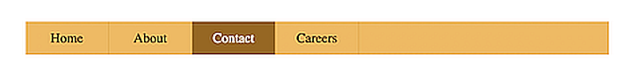
</p>
<!--~~~~~~~~~~~~~~~~~~~~~~~~~~~~~~~~~~~~~~~~~~-->
<h3>The HTML</h3>
<!--~~~~~~~~~~~~~~~~~~~~~~~~~~~~~~~~~~~~~~~~~~-->

```
<div class="container">
  <nav>
    <ul class="bar">
      <li><a href="#">Home</a></li>
      <li><a href="#">About</a></li>
      <li><a href="#" class="active">Contact</a></li>
      <li><a href="#">Careers</a></li>
    </ul>
  </nav>
</div>
```

<!--~~~~~~~~~~~~~~~~~~~~~~~~~~~~~~~~~~~~~~~~~~-->
<h3>The CSS</h3>
<!--~~~~~~~~~~~~~~~~~~~~~~~~~~~~~~~~~~~~~~~~~~-->
<details open>
  <summary>The CSS</summary>

```
.bar {
  background-color: rgb(245, 193, 97);
  width: 100%;
  height: 40px;
  display: flex;
  list-style: none;
  padding: 0;
}
.bar li {
  height: 100%;
  width: 100px;
  border-right: 1px solid rgb(235, 177, 69);
}
.bar li a {
  color: black;
  width: 100%;
  height: 100%;
  display: flex;
  align-items: center;
  justify-content: center;
  text-decoration: none;
}
.bar li a:hover {
  background-color: rgb(235, 177, 69);
}
.bar li a.active {
  background-color: rgb(165, 113, 16);
  color: white;
}
```

</details>
<!--~~~~~~~~~~~~~~~~~~~~~~~~~~~~~~~~~~~~~~~~~~-->
<div align="right">
  <b><a href="#toc">↥ back to top</a></b>
</div>
<!--~~~~~~~~~~~~~~~~~~~~~~~~~~~~~~~~~~~~~~~~~~~~~~~~~~~~~~~~~~~~~~~~~~~~~~~~~~~~~~~~~~~~~~~~~~~~-->
<h2><a name="button-transition">Example #2: Menu: 4 vertical options, 4th active</a></h2>
<!--~~~~~~~~~~~~~~~~~ 02. menu: four vertical options with 4th one active (01) ~~~~~~~~~~~~~~~~~-->
<p align="center">
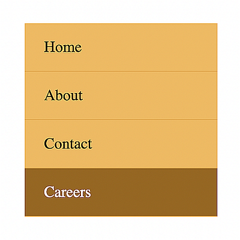
</p>
<!-- {width="1.7239588801399826in" height="1.7239588801399826in"} -->

<!--~~~~~~~~~~~~~~~~~~~~~~~~~~~~~~~~~~~~~~~~~~-->
<h3>The HTML</h3>
<!--~~~~~~~~~~~~~~~~~~~~~~~~~~~~~~~~~~~~~~~~~~-->

```
<div class="container">
  <nav>
    <ul class="bar">
      <li><a href="#">Home</a></li>
      <li><a href="#">About</a></li>
      <li><a href="#">Contact</a></li>
      <li><a href="#" class="active">Careers</a></li>
    </ul>
  </nav>
</div>
```

<!--~~~~~~~~~~~~~~~~~~~~~~~~~~~~~~~~~~~~~~~~~~-->
<h3>The CSS</h3>
<!--~~~~~~~~~~~~~~~~~~~~~~~~~~~~~~~~~~~~~~~~~~-->
<details open>
  <summary>The CSS</summary>

```
.bar {
  background-color: rgb(245, 193, 97);
  max-width: 200px;
  width: 100%;
  list-style: none;
  padding: 0;
}
.bar li {
  height: 100%;
  width: 100%;
  height: 50px;
  border-bottom: 1px solid rgb(235, 177, 69);
}
.bar li a {
  padding-left: 20px;
  text-align: left;
  color: black;
  max-width: 100%;
  height: 100%;
  display: flex;
  align-items: center;
  text-decoration: none;
}
.bar li a:hover {
  background-color: rgb(235, 177, 69);
}
.bar li a.active {
  background-color: rgb(165, 113, 16);
  color: white;
}
```

</details>
<!--~~~~~~~~~~~~~~~~~~~~~~~~~~~~~~~~~~~~~~~~~~-->
<div align="right">
  <b><a href="#toc">↥ back to top</a></b>
</div>
<!--~~~~~~~~~~~~~~~~~~~~~~~~~~~~~~~~~~~~~~~~~~~~~~~~~~~~~~~~~~~~~~~~~~~~~~~~~~~~~~~~~~~~~~~~~~~~-->
<h2><a name="web-form-search-bar">Example #3: Menu: four horizontal options with 2 dropdowns, 1st is active</a></h2>
<!--~~~~~~~~~~ 03. menu: four horizontal options with 2 dropdowns, 1st option active ~~~~~~~~~~~-->
<p align="center">
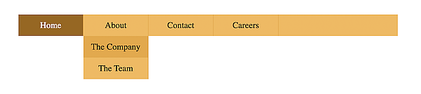
</p>
<!-- {width="5.947916666666667in" height="1.09375in"} -->

<!--~~~~~~~~~~~~~~~~~~~~~~~~~~~~~~~~~~~~~~~~~~-->
<h3>The HTML</h3>
<!--~~~~~~~~~~~~~~~~~~~~~~~~~~~~~~~~~~~~~~~~~~-->
<details open>
  <summary>The HTML</summary>

```
<div class="container">
  <nav>
    <ul class="bar">
      <li><a href="#" class="active">Home</a></li>
      <li class="has-dropdown">
        <a href="#">About</a>
        <ul class="dropdown">
          <li><a href="#">The Company</a></li>
          <li><a href="#">The Team</a></li>
        </ul>
      </li>
      <li class="has-dropdown">
        <a href="#">Contact</a>
        <ul class="dropdown">
          <li><a href="#">Email</a></li>
          <li><a href="#">Phone</a></li>
        </ul>
      </li>
      <li><a href="#">Careers</a></li>
    </ul>
  </nav>
</div>
```

</details>
<!--~~~~~~~~~~~~~~~~~~~~~~~~~~~~~~~~~~~~~~~~~~-->
<h3>The CSS</h3>
<!--~~~~~~~~~~~~~~~~~~~~~~~~~~~~~~~~~~~~~~~~~~-->
<details open>
  <summary>The CSS</summary>

```
* {
box-sizing: border-box;
}
.bar {
  background-color: rgb(245, 193, 97);
  width: 100%;
  height: 40px;
  display: flex;
  list-style: none;
  padding: 0;
}
.bar li {
  height: 100%;
  width: 120px;
  border-right: 1px solid rgb(235, 177, 69);
}
.bar li a {
  color: black;
  width: 100%;
  height: 100%;
  display: flex;
  align-items: center;
  justify-content: center;
  text-decoration: none;
}
.bar .has-dropdown ul li a{
  padding: 12px 0;
}
.bar li a:hover {
  background-color: rgb(235, 177, 69);
}
.bar li a.active {
  background-color: rgb(165, 113, 16);
  color: white;
}
.dropdown {
  background-color: rgb(245, 193, 97);
  padding: 0;
  list-style: none;
  display: none;
}
.bar li.has-dropdown:hover .dropdown {
  display: block;
}
```

</details>
<!--~~~~~~~~~~~~~~~~~~~~~~~~~~~~~~~~~~~~~~~~~~-->
<div align="right">
  <b><a href="#toc">↥ back to top</a></b>
</div>
<!--~~~~~~~~~~~~~~~~~~~~~~~~~~~~~~~~~~~~~~~~~~~~~~~~~~~~~~~~~~~~~~~~~~~~~~~~~~~~~~~~~~~~~~~~~~~~-->
<h2><a name="lightbox-modal-element">Example #4: Menu: four horizontal options, 4th unique, 1st active</a></h2>
<!--~~~~~~~~~~~~ 04. menu: four horizontal options, 4th one unique, 1st active (01) ~~~~~~~~~~~~-->
<p align="center">
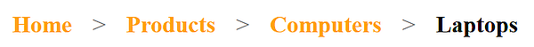
</p>
<!-- {width="6.5in" height="0.5833333333333334in"} -->

<!--~~~~~~~~~~~~~~~~~~~~~~~~~~~~~~~~~~~~~~~~~~-->
<h3>The HTML</h3>
<!--~~~~~~~~~~~~~~~~~~~~~~~~~~~~~~~~~~~~~~~~~~-->

```
<div class="container">
  <ul class="breadcrumb">
    <li><a href="#" class="active">Home</a></li>
    <li><span></span></li>
    <li><a href="#">Products</a></li>
    <li><span></span></li>
    <li><a href="#">Computers</a></li>
    <li><span></span></li>
    <li><a href="#" class="unique">Laptops</a></li>
  </ul>
</div>
```

<!--~~~~~~~~~~~~~~~~~~~~~~~~~~~~~~~~~~~~~~~~~~-->
<h3>The CSS</h3>
<!--~~~~~~~~~~~~~~~~~~~~~~~~~~~~~~~~~~~~~~~~~~-->
<details open>
  <summary>The CSS</summary>

```
.breadcrumb {
  list-style: none;
  padding: 0;
  display: flex;
  font-size: 20px;
  justify-content: space-around;
  max-width: 450px;
}
.breadcrumb a {
  text-decoration: none;
  color: rgb(110, 110, 110);
  font-weight: bold;
}
.breadcrumb li span{
  color: gray;
}
.breadcrumb li a {
  color: orange;
  transition: color 300ms;
}
.breadcrumb li .unique {
  color: #000;
}
.breadcrumb li a:hover {
  color: rgb(176, 115, 0);
}
```

</details>
<!--~~~~~~~~~~~~~~~~~~~~~~~~~~~~~~~~~~~~~~~~~~-->
<div align="right">
  <b><a href="#toc">↥ back to top</a></b>
</div>
<!--~~~~~~~~~~~~~~~~~~~~~~~~~~~~~~~~~~~~~~~~~~~~~~~~~~~~~~~~~~~~~~~~~~~~~~~~~~~~~~~~~~~~~~~~~~~~-->
<h2><a name="tooltip">Example #5</a></h2>
<!--~~~~~~~~~~~~~~~~~~~~~~~~~~~~~~~~~~~~~~~~~~~~~~~~~~~~~~~~~~~~~~~~~~~~~~~~~~~~~~~~~~~~~~~~~~~~-->
<h3>3 Button Transition Templates</h3>
<!--~~~~~~~~~~~~~~~~~~~~~~~~~~~~~~~~~~~~~~~~~~~~~~~~~~~~~~~~~~~~~~~~~~~~~~~~~~~~~~~~~~~~~~~~~~~~-->
<h3>Example #1</h3>
<!--~~~~~~~~~~~~~~~~~~~~~~~~~~~~~~~~~~~~~~~~~~~~~~~~~~~~~~~~~~~~~~~~~~~~~~~~~~~~~~~~~~~~~~~~~~~~-->
<p align="center">
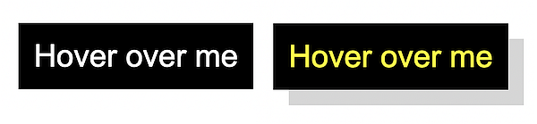
</p>
<!-- {width="6.5in" height="1.5138888888888888in"} -->

<!--~~~~~~~~~~~~~~~~~~~~~~~~~~~~~~~~~~~~~~~~~~-->
<h3>The HTML</h3>
<!--~~~~~~~~~~~~~~~~~~~~~~~~~~~~~~~~~~~~~~~~~~-->

```
<button class="first">Hover over me</button>
```

<!--~~~~~~~~~~~~~~~~~~~~~~~~~~~~~~~~~~~~~~~~~~-->
<h3>The CSS (Hover Button)</h3>
<!--~~~~~~~~~~~~~~~~~~~~~~~~~~~~~~~~~~~~~~~~~~-->
<details open>
  <summary>The CSS</summary>

```
.first {
  padding: 10px;
  font-size: 20px;
  background-color: black;
  color: white;
  border: none;
  cursor: pointer;
  box-shadow: 0 0 0 #ccc;
  transition: box-shadow 300ms, color 300ms;
}
.first:hover {
  color: yellow;
  box-shadow: 10px 10px 0 rgb(219, 219, 219);
}
```

</details>
<!--~~~~~~~~~~~~~~~~~~~~~~~~~~~~~~~~~~~~~~~~~~-->
<div align="right">
  <b><a href="#toc">↥ back to top</a></b>
</div>
<!--~~~~~~~~~~~~~~~~~~~~~~~~~~~~~~~~~~~~~~~~~~~~~~~~~~~~~~~~~~~~~~~~~~~~~~~~~~~~~~~~~~~~~~~~~~~~-->
<h2><a name="progress-bar">Example #6: Click me Button</a></h2>
<!--~~~~~~~~~~~~~~~~~~~~~~~~~~~~~~~~~~~~~~~~~~~~~~~~~~~~~~~~~~~~~~~~~~~~~~~~~~~~~~~~~~~~~~~~~~~~-->
<p align="center">

</p>
<!-- {width="2.557292213473316in" height="1.1195516185476815in"} -->
<!--~~~~~~~~~~~~~~~~~~~~~~~~~~~~~~~~~~~~~~~~~~~~~~~~~~~~~~~~~~~~~~~~~~~~~~~~~~~~~~~~~~~~~~~~~~~~-->
<h2><a name="css-accordian">Example #7: Another Click me Button</a></h2>
<!--~~~~~~~~~~~~~~~~~~~~~~~~~~~~~~~~~~~~~~~~~~~~~~~~~~~~~~~~~~~~~~~~~~~~~~~~~~~~~~~~~~~~~~~~~~~~-->
<p align="center">
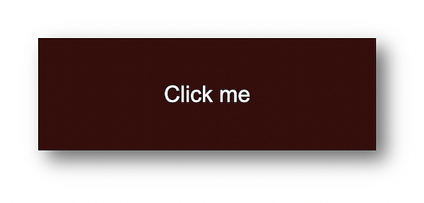
</p>
<!-- {width="4.078125546806649in" height="1.9507917760279965in"} -->
<!--~~~~~~~~~~~~~~~~~~~~~~~~~~~~~~~~~~~~~~~~~~-->
<div align="right">
  <b><a href="#toc">↥ back to top</a></b>
</div>
<!--~~~~~~~~~~~~~~~~~~~~~~~~~~~~~~~~~~~~~~~~~~-->
<h3>The HTML</h3>
<!--~~~~~~~~~~~~~~~~~~~~~~~~~~~~~~~~~~~~~~~~~~-->

```
<button class="second">Click me</button>
```

<h3>The CSS</h3>

<details open>
  <summary>CSS for Click Me!</summary>
  
```
.second {
  width: 180px;
  height: 60px;
  display: flex;
  align-items: center;
  justify-content: center;
  font-size: 20px;
  background-color: rgb(85, 16, 16);
  color: white;
  border: none;
  cursor: pointer;
  transition: transform 150ms,
  font-size 150ms, color 150ms;
}
.second:active {
  background-color: rgb(63, 5, 5);
  font-size: 12px;
  transform: scale(1.3);
  box-shadow: 5px 5px 10px rgb(119, 119, 119);
}
```

</details>
<!--~~~~~~~~~~~~~~~~~~~~~~~~~~~~~~~~~~~~~~~~~~~~~~~~~~~~~~~~~~~~~~~~~~~~~~~~~~~~~~~~~~~~~~~~~~~~-->
<h2><a name="css-effects">Example #8: Hover over me </a></h2>
<!--~~~~~~~~~~~~~~~~~~~~~~~~~~~~~~~~~~~~~~~~~~~~~~~~~~~~~~~~~~~~~~~~~~~~~~~~~~~~~~~~~~~~~~~~~~~~-->
<p align="center">
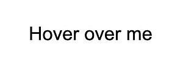
</p>
<!-- {width="2.0833333333333335in" height="0.53125in"} -->
<!--~~~~~~~~~~~~~~~~~~~~~~~~~~~~~~~~~~~~~~~~~~-->
<div align="right">
  <b><a href="#toc">↥ back to top</a></b>
</div>
<!--~~~~~~~~~~~~~~~~~~~~~~~~~~~~~~~~~~~~~~~~~~~~~~~~~~~~~~~~~~~~~~~~~~~~~~~~~~~~~~~~~~~~~~~~~~~~-->
<h2><a name="css-tab-nav">Example #9: Hover over me shadow</a></h2>
<!--~~~~~~~~~~~~~~~~~~~~~~~~~~~~~~~~~~~~~~~~~~~~~~~~~~~~~~~~~~~~~~~~~~~~~~~~~~~~~~~~~~~~~~~~~~~~-->
<p align="center">
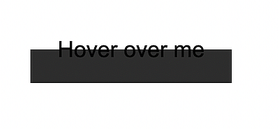
</p>
<!-- {width="2.2604166666666665in" height="0.7291666666666666in"} -->
<!--~~~~~~~~~~~~~~~~~~~~~~~~~~~~~~~~~~~~~~~~~~~~~~~~~~~~~~~~~~~~~~~~~~~~~~~~~~~~~~~~~~~~~~~~~~~~-->
<h2><a name="css-js-slideshow">Example #10: Hover over me (white on black)</a></h2>
<!--~~~~~~~~~~~~~~~~~~~~~~~~~~~~~~~~~~~~~~~~~~~~~~~~~~~~~~~~~~~~~~~~~~~~~~~~~~~~~~~~~~~~~~~~~~~~-->
<p align="center">
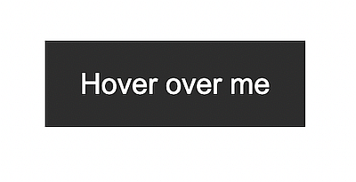
</p>
<!-- {width="1.8854166666666667in" height="0.6354166666666666in"} -->
<!--~~~~~~~~~~~~~~~~~~~~~~~~~~~~~~~~~~~~~~~~~~-->
<h3>The HTML</h3>
<!--~~~~~~~~~~~~~~~~~~~~~~~~~~~~~~~~~~~~~~~~~~-->

```
&lt;button class="third"&gt;Hover over me</button>
```

<!--~~~~~~~~~~~~~~~~~~~~~~~~~~~~~~~~~~~~~~~~~~-->
<h3>The CSS</h3>
<!--~~~~~~~~~~~~~~~~~~~~~~~~~~~~~~~~~~~~~~~~~~-->
<details open>
  <summary>The CSS</summary>

```
.third {
  border: none;
  background: none;
  width: 120px;
  height: 40px;
  cursor: pointer;
  position: relative;
  color: black;
  transition: color 500ms;
  overflow: hidden;
}
.third::after {
  content: "";
  background-color: #333;
  color: white;
  position: absolute;
  left: 0;
  bottom: -40px;
  width: 100%;
  height: 100%;
  transition: bottom 500ms;
  z-index: -1;
}
.third:hover {
  color: white;
}
.third:hover::after {
  bottom: 0;
}
```

</details>
<!--~~~~~~~~~~~~~~~~~~~~~~~~~~~~~~~~~~~~~~~~~~-->
<div align="right">
  <b><a href="#toc">↥ back to top</a></b>
</div>
<!--~~~~~~~~~~~~~~~~~~~~~~~~~~~~~~~~~~~~~~~~~~~~~~~~~~~~~~~~~~~~~~~~~~~~~~~~~~~~~~~~~~~~~~~~~~~~-->
<h2>3 Web Form & Search Bar Templates</h2>
<!--~~~~~~~~~~~~~~~~~~~~~~~~~~~~~~~~~~~~~~~~~~~~~~~~~~~~~~~~~~~~~~~~~~~~~~~~~~~~~~~~~~~~~~~~~~~~-->
<h2><a name="ex11">Example #11: Search form w/Check boxes</a></h2>
<!--~~~~~~~~~~~~~~~~~~~~~~~~~~~~~~~~~~~~~~~~~~~~~~~~~~~~~~~~~~~~~~~~~~~~~~~~~~~~~~~~~~~~~~~~~~~~-->
<h3>Template #1</h3>
<!--~~~~~~~~~~~~~~~~~~~~~~~~~~~~~~~~~~~~~~~~~~~~~~~~~~~~~~~~~~~~~~~~~~~~~~~~~~~~~~~~~~~~~~~~~~~~-->
<p align="center">
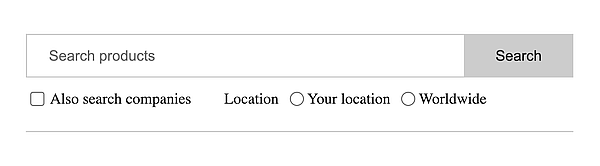
</p>
<!-- {width="6.5in" height="1.7916666666666667in"} -->
<!--~~~~~~~~~~~~~~~~~~~~~~~~~~~~~~~~~~~~~~~~~~-->
<h3>The HTML</h3>
<!--~~~~~~~~~~~~~~~~~~~~~~~~~~~~~~~~~~~~~~~~~~-->
<details open>
  <summary>The HTML</summary>

```
<form>
  <div class="search">
    <input type="text" placeholder="Search products" />
    <button type="submit">Search</button>
  </div>
  <div class="align-center bottom">
    <div class="checkbox-block">
      <input
        type="checkbox"
        name="companies_included"
        id="companies_included"
      />
      <label for="companies_included"
        >Also search companies
      </label>
    </div>
    <div class="inline-flex radio-block">
      <span>Location</span>
      <div class="inline-flex align-center">
        <input
          type="radio"
          name="location"
          value="Your location"
          id="your_location"
        />
        <label for="your_location"> Your location </label>
      </div>
      <div class="inline-flex align-center">
        <input
          type="radio"
          name="location"
          value="Worldwide"
          id="worldwide"
        />
        <label for="worldwide"> Worldwide </label>
      </div>
    </div>
  </div>
</form>
```

</details>
<!--~~~~~~~~~~~~~~~~~~~~~~~~~~~~~~~~~~~~~~~~~~-->
<div align="right">
  <b><a href="#toc">↥ back to top</a></b>
</div>
<!--~~~~~~~~~~~~~~~~~~~~~~~~~~~~~~~~~~~~~~~~~~-->
<h3>The CSS</h3>
<!--~~~~~~~~~~~~~~~~~~~~~~~~~~~~~~~~~~~~~~~~~~-->
<details open>
  <summary>The CSS</summary>

```
.align-center {
  display: flex;
  align-items: center;
}
.inline-flex {
  display: inline-flex;
}
form {
  padding: 20px 0;
  max-width: 500px;
  border-bottom: 1px solid #ccc;
}
.search {
  display: flex;
  outline: 1px solid #cccccc;
}
.search > input {
  flex-grow: 1;
  border: 0;
  padding: 0.5rem 1rem;
  font-size: 1rem;
}
.search > input:focus {
  outline: none;
}
.search > button {
  padding: 0.8rem 2rem;
  border: 0;
  cursor: pointer;
  font-size: 1rem;
  background: #cccccc;
}
.bottom {
  margin-top: 10px;
  font-size: 14px;
}
.checkbox-block {
  display: flex;
  align-items: center;
  margin-right: 30px;
}
.checkbox-block input {
  margin-right: 5px;
  cursor: pointer;
}
.radio-block input {
  margin: 0 3px 0 10px;
}
```

</details>
<!--~~~~~~~~~~~~~~~~~~~~~~~~~~~~~~~~~~~~~~~~~~-->
<div align="right">
  <b><a href="#toc">↥ back to top</a></b>
</div>
<!--~~~~~~~~~~~~~~~~~~~~~~~~~~~~~~~~~~~~~~~~~~~~~~~~~~~~~~~~~~~~~~~~~~~~~~~~~~~~~~~~~~~~~~~~~~~~-->
<h2>Template #2</h2>
<!--~~~~~~~~~~~~~~~~~~~~~~~~~~~~~~~~~~~~~~~~~~~~~~~~~~~~~~~~~~~~~~~~~~~~~~~~~~~~~~~~~~~~~~~~~~~~-->
<h2><a name="js-onclick-with-css">Example #12: Submit form</a></h2>
<!--~~~~~~~~~~~~~~~~~~~~~~~~~~~~~~~~~~~~~~~~~~~~~~~~~~~~~~~~~~~~~~~~~~~~~~~~~~~~~~~~~~~~~~~~~~~~-->
<p align="center">
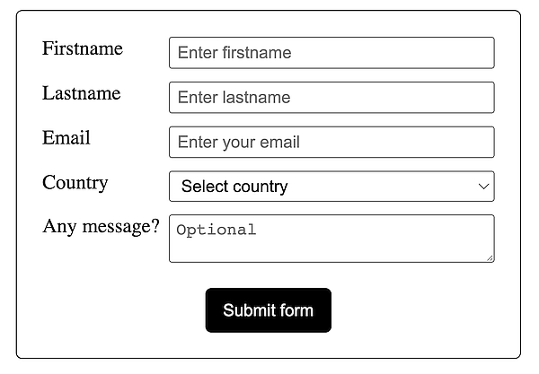
</p>
<!-- {width="6.5in" height="4.513888888888889in"} -->
<!--~~~~~~~~~~~~~~~~~~~~~~~~~~~~~~~~~~~~~~~~~~-->
<div align="right">
  <b><a href="#toc">↥ back to top</a></b>
</div>
<!--~~~~~~~~~~~~~~~~~~~~~~~~~~~~~~~~~~~~~~~~~~-->
<h3>The HTML</h3>
<!--~~~~~~~~~~~~~~~~~~~~~~~~~~~~~~~~~~~~~~~~~~-->
<details open>
  <summary>The HTML</summary>

```
<form>
  <div class="input-group">
    <label for="fname">Firstname</label>
    <input
      id="fname"
      name="fname"
      placeholder="Enter firstname"
      required="required"
    />
  </div>
  <div class="input-group">
    <label for="lname">Lastname</label>
    <input
      id="lname"
      name="lname"
      placeholder="Enter lastname"
      required="required"
    />
  </div>
  <div class="input-group">
    <label for="email">Email</label>
    <input
      id="email"
      type="email"
      name="email"
      placeholder="Enter your email"
    />
  </div>
  <div class="input-group">
    <label>Country</label>
    <select name="country" id="country" required="required">
      <option value="" selected="selected">Select country</option>
      <option value="Afghanistan">Afghanistan</option>
      <option value="Albania">Albania</option>
      <option value="Algeria">Algeria</option>
      <option value="American Samoa">American Samoa</option>
      <option value="Andorra">Andorra</option>
      <option value="Angola">Angola</option>
      <option value="Anguilla">Anguilla</option>
      <option value="Antarctica">Antarctica</option>
    </select>
  </div>
  <div class="input-group">
    <label for="message">Any message?</label>
    <textarea
      id="message"
      name="message"
      placeholder="Optional"
    ></textarea>
  </div>
  <div class="submit-group">
    <button type="submit">Submit form</button>
  </div>
</form>
```

</details>
<!--~~~~~~~~~~~~~~~~~~~~~~~~~~~~~~~~~~~~~~~~~~-->
<div align="right">
  <b><a href="#toc">↥ back to top</a></b>
</div>
<!--~~~~~~~~~~~~~~~~~~~~~~~~~~~~~~~~~~~~~~~~~~-->
<h3>The CSS</h3>
<!--~~~~~~~~~~~~~~~~~~~~~~~~~~~~~~~~~~~~~~~~~~-->
<details open>
  <summary>The CSS</summary>

```
* {
  box-sizing: border-box;
}
body {
  margin: 30px;
}
form {
  border: 1px solid #333;
  padding: 20px;
  max-width: 400px;
  margin: 0 auto;
  border-radius: 5px;
}
.input-group {
  display: flex;
  margin-bottom: 10px;
}
label {
  width: 100px;
}
input,
select,
textarea {
  flex: 1;
  padding: 3px 5px;
}
.submit-group {
  display: flex;
  align-items: center;
  justify-content: center;
  margin-top: 20px;
}
button {
  width: 100px;
  margin: 0 auto;
  background-color: black;
  color: white;
  border: none;
  padding: 10px;
  cursor: pointer;
  border-radius: 5px;
}
```

</details>
<!--~~~~~~~~~~~~~~~~~~~~~~~~~~~~~~~~~~~~~~~~~~-->
<div align="right">
  <b><a href="#toc">↥ back to top</a></b>
</div>
<!--~~~~~~~~~~~~~~~~~~~~~~~~~~~~~~~~~~~~~~~~~~~~~~~~~~~~~~~~~~~~~~~~~~~~~~~~~~~~~~~~~~~~~~~~~~~~-->
<h2><a name="html-video-audio">Example #13: Submit survey radio buttons, dropdown, textarea</a></h2>
<!--~~~~~~~~~~~~~~~~~~~~~~~~~~~~~~~~~~~~~~~~~~~~~~~~~~~~~~~~~~~~~~~~~~~~~~~~~~~~~~~~~~~~~~~~~~~~-->
<h2>Template #2</h2>
<!--~~~~~~~~~~~~~~~~~~~~~~~~~~~~~~~~~~~~~~~~~~~~~~~~~~~~~~~~~~~~~~~~~~~~~~~~~~~~~~~~~~~~~~~~~~~~-->
<p align="center">
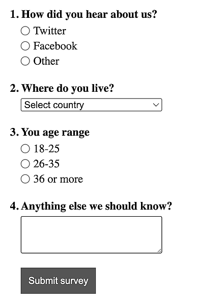
</p>
<!-- {width="3.7226859142607176in" height="5.776042213473316in"} -->
<!--~~~~~~~~~~~~~~~~~~~~~~~~~~~~~~~~~~~~~~~~~~-->
<div align="right">
  <b><a href="#toc">↥ back to top</a></b>
</div>
<!--~~~~~~~~~~~~~~~~~~~~~~~~~~~~~~~~~~~~~~~~~~-->
<h3>The HTML</h3>
<!--~~~~~~~~~~~~~~~~~~~~~~~~~~~~~~~~~~~~~~~~~~-->
<details open>
  <summary>The HTML</summary>

```
<form>
  <div>
    <span class="question">1. How did you hear about us?</span>
    <div class="radio-group">
      <div class="radio-item">
        <input type="radio" name="hear_about_us" id="twitter" />
        <label for="twitter">Twitter</label>
      </div>
      <div class="radio-item">
        <input type="radio" name="hear_about_us" id="facebook" />
        <label for="facebook">Facebook</label>
      </div>
      <div class="radio-item">
        <input type="radio" name="hear_about_us" id="other" />
        <label for="other">Other</label>
      </div>
    </div>
  </div>
  <div>
    <span class="question">2. Where do you live?</span>
    <select name="country" id="country" required="required">
      <option value="" selected="selected">Select country</option>
      <option value="Afghanistan">Afghanistan</option>
      <option value="Albania">Albania</option>
      <option value="Algeria">Algeria</option>
      <option value="American Samoa">American Samoa</option>
      <option value="Andorra">Andorra</option>
      <option value="Angola">Angola</option>
      <option value="Anguilla">Anguilla</option>
      <option value="Antarctica">Antarctica</option>
    </select>
  </div>
  <div>
    <span class="question">3. You age range</span>
    <div class="radio-group">
      <div class="radio-item">
        <input type="radio" name="age_range" id="lower" />
        <label for="lower">18-25</label>
      </div>
      <div class="radio-item">
        <input type="radio" name="age_range" id="middle" />
        <label for="middle">26-35</label>
      </div>
      <div class="radio-item">
        <input type="radio" name="age_range" id="higher" />
        <label for="higher">36 or more</label>
      </div>
    </div>
  </div>
  <div>
    <span class="question">4. Anything else we should know? </span>
    <textarea name="message"></textarea>
  </div>
  <div>
    <button class="submit-btn">Submit survey</button>
  </div>
</form>
```

</details>
<!--~~~~~~~~~~~~~~~~~~~~~~~~~~~~~~~~~~~~~~~~~~-->
<div align="right">
  <b><a href="#toc">↥ back to top</a></b>
</div>
<!--~~~~~~~~~~~~~~~~~~~~~~~~~~~~~~~~~~~~~~~~~~-->
<h3>The CSS</h3>
<!--~~~~~~~~~~~~~~~~~~~~~~~~~~~~~~~~~~~~~~~~~~-->
<details open>
  <summary>The CSS</summary>

```
* {
  box-sizing: border-box;
}
body {
  margin: 30px;
}
form {
  max-width: 400px;
}
form > div {
  margin-bottom: 20px;
}
.question {
  font-weight: bold;
  display: block;
  margin-bottom: 5px;
}
.radio-group,
select,
textarea {
  margin-left: 15px;
  width: 200px;
}
textarea {
  padding: 10px;
}
.radio-item {
  display: flex;
  align-items: center;
  margin-bottom: 3px;
}
.radio-item label {
  margin-left: 5px;
}
.radio-item input {
  margin: 0;
}
.submit-btn {
  margin-left: 15px;
  background-color: #555;
  border: 1px solid #555;
  color: white;
  padding: 10px;
  cursor: pointer;
}
```

</details>
<!--~~~~~~~~~~~~~~~~~~~~~~~~~~~~~~~~~~~~~~~~~~-->
<div align="right">
  <b><a href="#toc">↥ back to top</a></b>
</div>
<!--~~~~~~~~~~~~~~~~~~~~~~~~~~~~~~~~~~~~~~~~~~~~~~~~~~~~~~~~~~~~~~~~~~~~~~~~~~~~~~~~~~~~~~~~~~~~-->
<h2><a name="css-background">Example #14: CSS Background images (4)</a></h2>
<!--~~~~~~~~~~~~~~~~~~~~~~~~~~~~~~~~~~~~~~~~~~~~~~~~~~~~~~~~~~~~~~~~~~~~~~~~~~~~~~~~~~~~~~~~~~~~-->
<h2>Lightbox Modal Element Template</h2>
<!--~~~~~~~~~~~~~~~~~~~~~~~~~~~~~~~~~~~~~~~~~~~~~~~~~~~~~~~~~~~~~~~~~~~~~~~~~~~~~~~~~~~~~~~~~~~~-->
<p align="center">
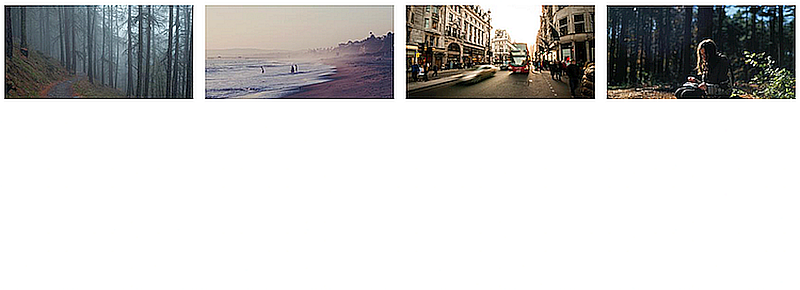
</p>
<!-- {width="5.598958880139983in" height="0.7088429571303587in"} -->
<!--~~~~~~~~~~~~~~~~~~~~~~~~~~~~~~~~~~~~~~~~~~~~~~~~~~~~~~~~~~~~~~~~~~~~~~~~~~~~~~~~~~~~~~~~~~~~-->
<h2><a name="css-gradient">Example #15: </a></h2>
<!--~~~~~~~~~~~~~~~~~~~~~~~~~~~~~~~~~~~~~~~~~~~~~~~~~~~~~~~~~~~~~~~~~~~~~~~~~~~~~~~~~~~~~~~~~~~~-->
<p align="center">
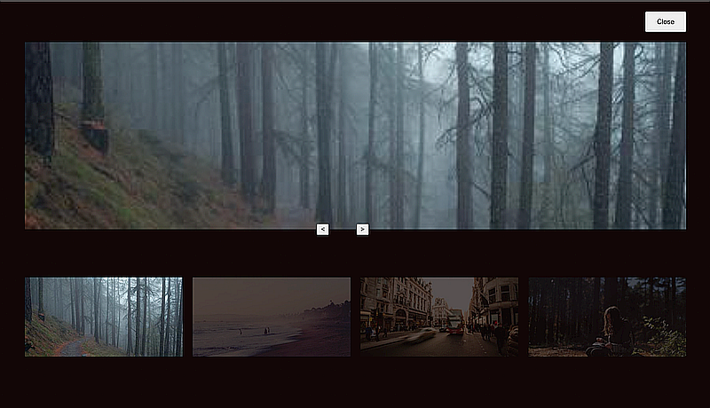
</p>
<!-- {width="5.619792213473316in" height="3.2331813210848646in"} -->
<!--~~~~~~~~~~~~~~~~~~~~~~~~~~~~~~~~~~~~~~~~~~-->
<div align="right">
  <b><a href="#toc">↥ back to top</a></b>
</div>
<!--~~~~~~~~~~~~~~~~~~~~~~~~~~~~~~~~~~~~~~~~~~~~~~~~~~~~~~~~~~~~~~~~~~~~~~~~~~~~~~~~~~~~~~~~~~~~-->
<h2><a name="css-overflow">Example #16: </a></h2>
<!--~~~~~~~~~~~~~~~~~~~~~~~~~~~~~~~~~~~~~~~~~~~~~~~~~~~~~~~~~~~~~~~~~~~~~~~~~~~~~~~~~~~~~~~~~~~~-->
<p align="center">
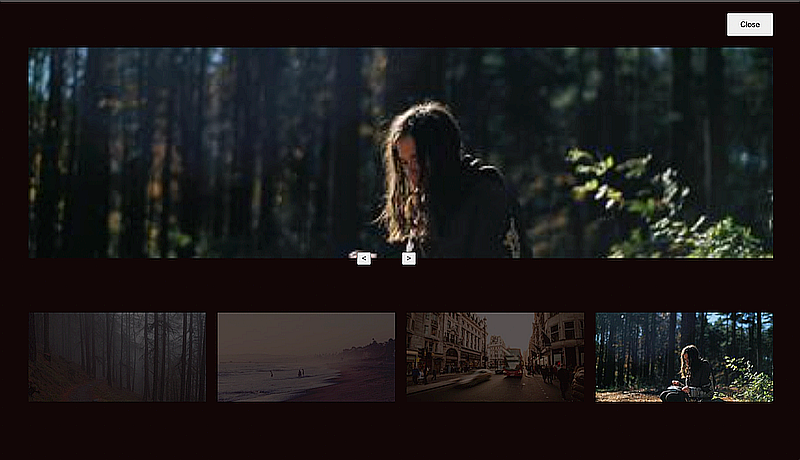
</p>
<!-- {width="5.692708880139983in" height="3.270278871391076in"} -->
<!--~~~~~~~~~~~~~~~~~~~~~~~~~~~~~~~~~~~~~~~~~~-->
<div align="right">
  <b><a href="#toc">↥ back to top</a></b>
</div>
<!--~~~~~~~~~~~~~~~~~~~~~~~~~~~~~~~~~~~~~~~~~~-->
<h3>The HTML</h3>
<!--~~~~~~~~~~~~~~~~~~~~~~~~~~~~~~~~~~~~~~~~~~-->
<details open>
  <summary>The HTML</summary>

```
<div class="images">


</div>
<div id="lightbox" class="lightbox">
<button onclick="closeModal()" class="close-btn">
```

</details>
<!--~~~~~~~~~~~~~~~~~~~~~~~~~~~~~~~~~~~~~~~~~~-->
<h3>Close</h3>
<!--~~~~~~~~~~~~~~~~~~~~~~~~~~~~~~~~~~~~~~~~~~-->
<details open>
  <summary>The HTML</summary>

```
  </button>
  <div class="image-preview">
    
  </div>
  <div class="control-btns">
    <button onclick="control(-1)" class="control-left">
    </button>
    <button onclick="control(1)" class="control-left">
    </button>
  </div>
  <div id="modal-images-block" class="lightbox__images">
    
    
    
    
  </div>
</div>
```

</details>
<!--~~~~~~~~~~~~~~~~~~~~~~~~~~~~~~~~~~~~~~~~~~-->
<div align="right">
  <b><a href="#toc">↥ back to top</a></b>
</div>
<!--~~~~~~~~~~~~~~~~~~~~~~~~~~~~~~~~~~~~~~~~~~-->
<h3>The CSS</h3>
<!--~~~~~~~~~~~~~~~~~~~~~~~~~~~~~~~~~~~~~~~~~~-->
<details open>
  <summary>The CSS</summary>

```
* {
  box-sizing: border-box;
}
.images {
  display: grid;
  grid-template-columns: repeat(4, 1fr);
  grid-gap: 20px;
}
.images img {
  width: 100%;
  height: 100%;
  cursor: pointer;
}
.lightbox {
  position: absolute;
  left: 0;
  top: 0;
  padding: 0 50px 30px;
  width: 100%;
  height: 100vh;
  background-color: rgb(18, 7, 7);
  display: none;
  flex-direction: column;
}
.lightbox.visible {
  display: flex;
}
.lightbox .close-btn {
  width: 80px;
  align-self: flex-end;
  height: 40px;
  margin: 20px 0;
}
.lightbox .image-preview {
  width: 100%;
  margin: 0 auto;
  flex: 1;
  height: 100%;
  overflow: hidden;
  display: flex;
  flex-direction: column;
  align-items: center;
}
.image-preview img {
  width: 100%;
  height: 100%;
  object-fit: cover;
}
.control-btns {
  position: relative;
  top: -10px;
  margin: 0 auto;
}
.control-btns button {
  cursor: pointer;
}
.control-left {
  margin-right: 50px;
}
.lightbox__images {
  height: 300px;
  display: grid;
  grid-template-columns: repeat(4, 1fr);
  grid-gap: 20px;
  align-items: center;
}
.lightbox__images img {
  width: 100%;
  opacity: 0.3;
  cursor: pointer;
}
.lightbox__images img.active {
  width: 100%;
  opacity: 1;
}
```

</details>
<!--~~~~~~~~~~~~~~~~~~~~~~~~~~~~~~~~~~~~~~~~~~-->
<div align="right">
  <b><a href="#toc">↥ back to top</a></b>
</div>
<!--~~~~~~~~~~~~~~~~~~~~~~~~~~~~~~~~~~~~~~~~~~-->
<h3>The JavaScript</h3>
<!--~~~~~~~~~~~~~~~~~~~~~~~~~~~~~~~~~~~~~~~~~~-->
<details open>
  <summary>The JavaScript</summary>

```
const IMAGE0 =
"https://i.picsum.photos/id/229/400/200.jpg?hmac=ULnwo8IFtjR3PshWPNEvFWNU8Xwl_OIeUtVmZIQanhU"
const IMAGE1 =
"https://i.picsum.photos/id/154/400/200.jpg?hmac=uhKcJIPoFcq2xMC16yvZAwA8sTeIbThUr-Njq0DkhSU"
const IMAGE2 =
"https://i.picsum.photos/id/690/400/200.jpg?hmac=kOkDXkZEUaSUQviVm67apRu5EPMD_L0rHfKVt32iogQ"
const IMAGE3 =
"https://i.picsum.photos/id/633/400/200.jpg?hmac=-axbA3Zg3r_xPYOy7OdaIb5yTFDBKubd9LYJrnwpHeU"
const images = [IMAGE0, IMAGE1, IMAGE2, IMAGE3]
const image0 = document.getElementById("image0")
const image1 = document.getElementById("image1")
const image2 = document.getElementById("image2")
const image3 = document.getElementById("image3")
const lightbox = document.getElementById("lightbox")
const previewImg = document.getElementById("preview-image")
const modalImagesBlock = document.getElementById(
  "modal-images-block"
)
image0.src = IMAGE0
image1.src = IMAGE1
image2.src = IMAGE2
image3.src = IMAGE3
let activeId = null
previewImg.src = images[0]
const modalImagesElements =
modalImagesBlock.getElementsByTagName("img")
const modalImages = Object.values(modalImagesElements)
modalImages.forEach((imageElement, i) => {
  console.log(imageElement)
  imageElement.src = images[i]
})
function openModal(imgId) {
  if (activeId !== null) {
    modalImages[activeId].classList.remove("active")
  }
  activeId = imgId
  lightbox.classList.add("visible")
  previewImg.src = images[imgId]
  modalImages[imgId].classList.add("active")
}
function closeModal() {
  lightbox.classList.remove("visible")
}
function control(direction) {
  const prevId = activeId
  if (direction === 1) {
    // next
    activeId =
    activeId + 1 > images.length - 1
    ? // then go to the beginning
    (activeId = 0)
    : (activeId = activeId + 1)
  } else {
    // previous
    activeId =
    activeId - 1 < 0
    ? // then go to the end
    (activeId = images.length - 1)
    : activeId - 1
  }
  previewImg.src = images[activeId]
  modalImages[activeId].classList.add("active")
  modalImages[prevId].classList.remove("active")
}
```

</details>
<!--~~~~~~~~~~~~~~~~~~~~~~~~~~~~~~~~~~~~~~~~~~~~~~~~~~~~~~~~~~~~~~~~~~~~~~~~~~~~~~~~~~~~~~~~~~~~-->
<h2><a name="css-animation">Example #17: Top Tooltip</a></h2>
<!--~~~~~~~~~~~~~~~~~~~~~~~~~~~~~~~~~~~~~~~~~~~~~~~~~~~~~~~~~~~~~~~~~~~~~~~~~~~~~~~~~~~~~~~~~~~~-->
<p align="center">
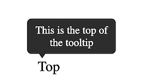
</p>
<!-- {width="3.5208333333333335in" height="1.4479166666666667in"} -->
<!--~~~~~~~~~~~~~~~~~~~~~~~~~~~~~~~~~~~~~~~~~~-->
<div align="right">
  <b><a href="#toc">↥ back to top</a></b>
</div>
<!--~~~~~~~~~~~~~~~~~~~~~~~~~~~~~~~~~~~~~~~~~~-->
<h3>The HTML</h3>
<!--~~~~~~~~~~~~~~~~~~~~~~~~~~~~~~~~~~~~~~~~~~-->
<details open>
  <summary>The HTML</summary>

```
<div class="tooltip">
  <span>Top</span>
  <div class="tooltip-text">This is the top of the tooltip</div>
</div>
```

</details>
<!--~~~~~~~~~~~~~~~~~~~~~~~~~~~~~~~~~~~~~~~~~~-->
<h3>The CSS</h3>
<!--~~~~~~~~~~~~~~~~~~~~~~~~~~~~~~~~~~~~~~~~~~-->
<details open>
  <summary>The CSS</summary>

```
body {
  margin: 60px;
}
.tooltip {
  position: relative;
  display: inline-block;
}
.tooltip-text {
  padding: 6px;
  background-color: #333;
  color: white;
  font-size: 12px;
  position: absolute;
  border-radius: 5px;
  width: 100px;
  text-align: center;
  display: inline-block;
  top: -45px;
  left: -12px;
  visibility: hidden;
}
.tooltip-text::after {
  content: "";
  position: absolute;
  left: 10px;
  bottom: -5px;
  width: 0;
  height: 0;
  border-left: 7px solid transparent;
  border-right: 7px solid transparent;
  border-top: 10px solid #333;
}
.tooltip:hover .tooltip-text {
  visibility: visible;
}
```

</details>
<!--~~~~~~~~~~~~~~~~~~~~~~~~~~~~~~~~~~~~~~~~~~~~~~~~~~~~~~~~~~~~~~~~~~~~~~~~~~~~~~~~~~~~~~~~~~~~-->
<h2><a name="ex18">Example #18: Right tooltip</a></h2>
<!--~~~~~~~~~~~~~~~~~~~~~~~~~~~~~~~~~~~~~~~~~~~~~~~~~~~~~~~~~~~~~~~~~~~~~~~~~~~~~~~~~~~~~~~~~~~~-->
<p align="center">
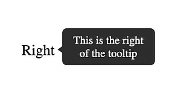
</p>
<!-- {width="4.0625in" height="1.03125in"} -->
<!--~~~~~~~~~~~~~~~~~~~~~~~~~~~~~~~~~~~~~~~~~~-->
<div align="right">
  <b><a href="#toc">↥ back to top</a></b>
</div>
<!--~~~~~~~~~~~~~~~~~~~~~~~~~~~~~~~~~~~~~~~~~~-->
<h3>The HTML</h3>
<!--~~~~~~~~~~~~~~~~~~~~~~~~~~~~~~~~~~~~~~~~~~-->

```
<div class="tooltip">
  <span>Right</span>
  <div class="tooltip-text">This is the right of the tooltip</div>
</div>
```

<!--~~~~~~~~~~~~~~~~~~~~~~~~~~~~~~~~~~~~~~~~~~-->
<h3>The CSS</h3>
<!--~~~~~~~~~~~~~~~~~~~~~~~~~~~~~~~~~~~~~~~~~~-->
<details open>
  <summary>The CSS</summary>

```
.tooltip {
  position: relative;
  display: inline-block;
}
.tooltip-text {
  padding: 6px;
  background-color: #333;
  color: white;
  font-size: 12px;
  position: absolute;
  border-radius: 5px;
  width: 100px;
  text-align: center;
  right: -120px;
  bottom: -7px;
  visibility: hidden;
}
.tooltip-text::after {
  content: "";
  position: absolute;
  left: -5px;
  bottom: 10px;
  width: 0;
  height: 0;
  border-top: 7px solid transparent;
  border-bottom: 7px solid transparent;
  border-right: 10px solid #333;
}
.tooltip:hover .tooltip-text {
  visibility: visible;
}
```

</details>
<!--~~~~~~~~~~~~~~~~~~~~~~~~~~~~~~~~~~~~~~~~~~~~~~~~~~~~~~~~~~~~~~~~~~~~~~~~~~~~~~~~~~~~~~~~~~~~-->
<h2><a name="ex19">Example #19: Bottom tooltip</a></h2>
<!--~~~~~~~~~~~~~~~~~~~~~~~~~~~~~~~~~~~~~~~~~~~~~~~~~~~~~~~~~~~~~~~~~~~~~~~~~~~~~~~~~~~~~~~~~~~~-->
<p align="center">
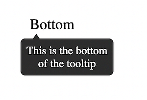
</p>
<!-- {width="3.2916666666666665in" height="1.4583333333333333in"} -->
<!--~~~~~~~~~~~~~~~~~~~~~~~~~~~~~~~~~~~~~~~~~~-->
<div align="right">
  <b><a href="#toc">↥ back to top</a></b>
</div>
<!--~~~~~~~~~~~~~~~~~~~~~~~~~~~~~~~~~~~~~~~~~~-->
<h3>The HTML</h3>
<!--~~~~~~~~~~~~~~~~~~~~~~~~~~~~~~~~~~~~~~~~~~-->

```
<div class="tooltip">
  <span>Bottom</span>
  <div class="tooltip-text"> This is the bottom of the tooltip
  </div>
</div>
```

<!--~~~~~~~~~~~~~~~~~~~~~~~~~~~~~~~~~~~~~~~~~~-->
<h3>The CSS</h3>
<!--~~~~~~~~~~~~~~~~~~~~~~~~~~~~~~~~~~~~~~~~~~-->
<details open>
  <summary>The CSS</summary>

```
.tooltip {
  position: relative;
  display: inline-block;
}
.tooltip-text {
  padding: 6px;
  background-color: #333;
  color: white;
  font-size: 12px;
  position: absolute;
  border-radius: 5px;
  width: 100px;
  text-align: center;
  display: inline-block;
  bottom: -46px;
  left: -10px;
  visibility: hidden;
}
.tooltip-text::after {
  content: "";
  position: absolute;
  left: 10px;
  top: -5px;
  width: 0;
  height: 0;
  border-left: 7px solid transparent;
  border-right: 7px solid transparent;
  border-bottom: 10px solid #333;
}
.tooltip:hover .tooltip-text {
  visibility: visible;
}
```

</details>
<!--~~~~~~~~~~~~~~~~~~~~~~~~~~~~~~~~~~~~~~~~~~~~~~~~~~~~~~~~~~~~~~~~~~~~~~~~~~~~~~~~~~~~~~~~~~~~-->
<h2><a name="ex20">Example #20: Left tooltip</a></h2>
<!--~~~~~~~~~~~~~~~~~~~~~~~~~~~~~~~~~~~~~~~~~~~~~~~~~~~~~~~~~~~~~~~~~~~~~~~~~~~~~~~~~~~~~~~~~~~~-->
<p align="center">
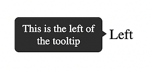
</p>
<!-- {width="3.6041666666666665in" height="0.9166666666666666in"} -->
<!--~~~~~~~~~~~~~~~~~~~~~~~~~~~~~~~~~~~~~~~~~~-->
<div align="right">
  <b><a href="#toc">↥ back to top</a></b>
</div>
<!--~~~~~~~~~~~~~~~~~~~~~~~~~~~~~~~~~~~~~~~~~~-->
<h3>The HTML</h3>
<!--~~~~~~~~~~~~~~~~~~~~~~~~~~~~~~~~~~~~~~~~~~-->

```
<div class="tooltip">
  <span>Left</span>
  <div class="tooltip-text">This is the left of the tooltip</div>
</div>
```

<!--~~~~~~~~~~~~~~~~~~~~~~~~~~~~~~~~~~~~~~~~~~-->
<h3>The CSS</h3>
<!--~~~~~~~~~~~~~~~~~~~~~~~~~~~~~~~~~~~~~~~~~~-->
<details open>
  <summary>The CSS</summary>

```
body {
  margin: 60px 130px;
}
.tooltip {
  position: relative;
  display: inline-block;
}
.tooltip-text {
  padding: 6px;
  background-color: #333;
  color: white;
  font-size: 12px;
  position: absolute;
  border-radius: 5px;
  width: 100px;
  text-align: center;
  left: -120px;
  bottom: -11px;
  visibility: hidden;
}
.tooltip-text::after {
  content: "";
  position: absolute;
  right: -5px;
  top: 12px;
  width: 0;
  height: 0;
  border-top: 7px solid transparent;
  border-bottom: 7px solid transparent;
  border-left: 10px solid #333;
}
.tooltip:hover .tooltip-text {
  visibility: visible;
}
```

</details>
<!--~~~~~~~~~~~~~~~~~~~~~~~~~~~~~~~~~~~~~~~~~~~~~~~~~~~~~~~~~~~~~~~~~~~~~~~~~~~~~~~~~~~~~~~~~~~~-->
<h2>2 Progress Bar Templates</h2>
<!--~~~~~~~~~~~~~~~~~~~~~~~~~~~~~~~~~~~~~~~~~~~~~~~~~~~~~~~~~~~~~~~~~~~~~~~~~~~~~~~~~~~~~~~~~~~~-->
<h2><a name="ex21">Example #21: Progress bar (50%)</a></h2>
<!--~~~~~~~~~~~~~~~~~~~~~~~~~~~~~~~~~~~~~~~~~~~~~~~~~~~~~~~~~~~~~~~~~~~~~~~~~~~~~~~~~~~~~~~~~~~~-->
<p align="center">
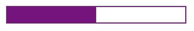
</p>
<!-- {width="5.375in" height="0.875in"} -->
<!--~~~~~~~~~~~~~~~~~~~~~~~~~~~~~~~~~~~~~~~~~~-->
<div align="right">
  <b><a href="#toc">↥ back to top</a></b>
</div>
<!--~~~~~~~~~~~~~~~~~~~~~~~~~~~~~~~~~~~~~~~~~~-->
<h3>The HTML</h3>
<!--~~~~~~~~~~~~~~~~~~~~~~~~~~~~~~~~~~~~~~~~~~-->

```
<progress class="first" value="50" max="100"></progress>
```

<!--~~~~~~~~~~~~~~~~~~~~~~~~~~~~~~~~~~~~~~~~~~-->
<h3>The CSS</h3>
<!--~~~~~~~~~~~~~~~~~~~~~~~~~~~~~~~~~~~~~~~~~~-->
<details open>
  <summary>The CSS</summary>

```
.first {
  border-radius: 0;
  border: 2px solid purple;
  height: 30px;
  width: 250px;
}
.first::-webkit-progress-bar {
  background-color: white;
}
.first::-webkit-progress-value {
  background-color: purple;
}
```

</details>
<!--~~~~~~~~~~~~~~~~~~~~~~~~~~~~~~~~~~~~~~~~~~~~~~~~~~~~~~~~~~~~~~~~~~~~~~~~~~~~~~~~~~~~~~~~~~~~-->
<h2 id="ex22">Example #22: Colored Progress bar (40%)</h2>
<!--~~~~~~~~~~~~~~~~~~~~~~~~~~~~~~~~~~~~~~~~~~~~~~~~~~~~~~~~~~~~~~~~~~~~~~~~~~~~~~~~~~~~~~~~~~~~-->
<h3>The HTML</h3>
<!--~~~~~~~~~~~~~~~~~~~~~~~~~~~~~~~~~~~~~~~~~~-->
<p align="center">

</p>
<!--~~~~~~~~~~~~~~~~~~~~~~~~~~~~~~~~~~~~~~~~~~~~~~~~~~~~~~~~~~~~~~~~~~~~~~~~~~~~~~~~~~~~~~~~~~~~-->
<h2><a name="ex23">Example #23: Colored Progress bar (80%)</a></h2>
<!--~~~~~~~~~~~~~~~~~~~~~~~~~~~~~~~~~~~~~~~~~~~~~~~~~~~~~~~~~~~~~~~~~~~~~~~~~~~~~~~~~~~~~~~~~~~~-->
<p align="center">

</p>

```
<progress class="second" value="40" max="100"></progress>
{width="5.083333333333333in" height="0.7395833333333334in"}
<progress class="second" value="80" max="100"></progress>
{width="5.0in" height="0.78125in"}
```

<!--~~~~~~~~~~~~~~~~~~~~~~~~~~~~~~~~~~~~~~~~~~-->
<h3>The CSS</h3>
<!--~~~~~~~~~~~~~~~~~~~~~~~~~~~~~~~~~~~~~~~~~~-->
<details open>
  <summary>The CSS</summary>

```
.second {
  overflow: hidden;
  border-radius: 15px;
  height: 30px;
  width: 200px;
}
.second::-webkit-progress-bar {
  border-radius: 15px;
  background-color: white;
  border: 1px solid #ccc;
}
.second::-webkit-progress-value {
  background-image: linear-gradient(
  90deg,
  hsl(0deg 91% 46%) 25px,
  hsl(41deg 100% 50%) 50px,
  hsl(63deg 100% 37%) 75px,
  rgb(85, 255, 0) 100px
);
border-radius: 15px;
}
```

</details>
<!--~~~~~~~~~~~~~~~~~~~~~~~~~~~~~~~~~~~~~~~~~~~~~~~~~~~~~~~~~~~~~~~~~~~~~~~~~~~~~~~~~~~~~~~~~~~~-->
<h2>2 CSS Accordian Templates</h2>
<!--~~~~~~~~~~~~~~~~~~~~~~~~~~~~~~~~~~~~~~~~~~~~~~~~~~~~~~~~~~~~~~~~~~~~~~~~~~~~~~~~~~~~~~~~~~~~-->
<h2>Example #1: Accordion Using Only CSS and HTML</h2>
<!--~~~~~~~~~~~~~~~~~~~~~~~~~~~~~~~~~~~~~~~~~~-->
<h3>The HTML</h3>
<!--~~~~~~~~~~~~~~~~~~~~~~~~~~~~~~~~~~~~~~~~~~-->
<details open>
  <summary>The HTML</summary>

```
<!DOCTYPE html>
<html lang="en">
<head>
  <title>Document</title>
  <link rel="stylesheet" href="style.css" />
</head>
<body>
  <div class="container">
    <h1>CSS Accordion</h1>
    <div class="accordion">
      <div class="tab">
        <input type="checkbox" id="tab1" />
        <label class="tab-label" for="tab1">Lorem ipsum 1</label>
        <div class="tab-content">
          Lorem ipsum dolor sit, amet consectetur adipisicing elit. Doloremque
          perferendis eligendi fugit quaerat consequatur fuga pariatur
          ratione, enim mollitia aut! Nobis maxime voluptas harum labore quos,
          tempore itaque quas excepturi.
        </div>
      </div>
      <div class="tab">
        <input type="checkbox" id="tab2" />
        <label class="tab-label" for="tab2">Lorem ipsum 2</label>
        <div class="tab-content">
          Lorem ipsum dolor sit, amet consectetur adipisicing elit. Doloremque
          perferendis eligendi fugit quaerat consequatur fuga pariatur
          ratione, enim mollitia aut! Nobis maxime voluptas harum labore quos,
          tempore itaque quas excepturi.
        </div>
      </div>
      <div class="tab">
        <input type="checkbox" id="tab3" />
        <label class="tab-label" for="tab3">Lorem ipsum 3</label>
        <div class="tab-content">
          Lorem ipsum dolor sit, amet consectetur adipisicing elit. Doloremque
          perferendis eligendi fugit quaerat consequatur fuga pariatur
          ratione, enim mollitia aut! Nobis maxime voluptas harum labore quos,
          tempore itaque quas excepturi.
        </div>
      </div>
    </div>
  </div>
</body>
</html>
```

</details>
<!--~~~~~~~~~~~~~~~~~~~~~~~~~~~~~~~~~~~~~~~~~~-->
<h3>The CSS</h3>
<!--~~~~~~~~~~~~~~~~~~~~~~~~~~~~~~~~~~~~~~~~~~-->
<details open>
  <summary>The CSS</summary>

```
@import
"https://fonts.googleapis.com/css?family=Montserrat:400,700&vert;Raleway:300,400";
body {
  color: #2c3e50;
  background: #ecf0f1;
  width: 100vw;
  padding: 0 1em 1em;
  font-family: "Raleway", sans-serif;
}
h1 {
  margin: 0;
  line-height: 2;
  text-align: center;
}
input {
  position: absolute;
  opacity: 0;
  z-index: -1;
}
/* Accordion styles */
.accordion {
  border-radius: 8px;
  width: 70vw;
  margin: 5rem auto 0;
  overflow: hidden;
  padding: 2rem 2.5rem;
  background-color: white;
  box-shadow: 0 4px 4px 2px rgba(0, 0, 0, 0.15);
}
.tab {
  width: 100%;
  color: #1a252f;
  overflow: hidden;
  margin: 1rem 0;
}
.tab-label {
  display: flex;
  justify-content: space-between;
  padding: 1rem;
  background: white;
  font-weight: bold;
  cursor: pointer;
}
.tab-label:hover {
  background: #dce7ea;
}
.tab-label::after {
  content: "❯";
  width: 1em;
  height: 1em;
  text-align: center;
  transition: all 0.35s;
}
.tab-content {
  max-height: 0;
  padding: 0 1em;
  line-height: 2rem;
  color: #1a252f;
  background: white;
  transition: all 0.35s;
}
.tab-close {
  display: flex;
  justify-content: flex-end;
  padding: 1em;
  font-size: 0.75em;
  background: #2c3e50;
  cursor: pointer;
}
.tab-close:hover {
  background: #dce7ea;
}
input:checked + .tab-label {
  background: #dce7ea;
}
input:checked + .tab-label::after {
  transform: rotate(90deg);
}
input:checked ~ .tab-content {
  max-height: 100vh;
  padding: 1rem;
}
```

</details>
<!--~~~~~~~~~~~~~~~~~~~~~~~~~~~~~~~~~~~~~~~~~~~~~~~~~~~~~~~~~~~~~~~~~~~~~~~~~~~~~~~~~~~~~~~~~~~~-->
<h2>Example #2: Accordion Using CSS and HTML and JavaScript</h2>
<!--~~~~~~~~~~~~~~~~~~~~~~~~~~~~~~~~~~~~~~~~~~~~~~~~~~~~~~~~~~~~~~~~~~~~~~~~~~~~~~~~~~~~~~~~~~~~-->
<h3>The HTML</h3>
<!--~~~~~~~~~~~~~~~~~~~~~~~~~~~~~~~~~~~~~~~~~~-->
<details open>
  <summary>The HTML</summary>

```
<!DOCTYPE html>
<html lang="en">
<head>
  <title>Document</title>
  <link rel="stylesheet" href="style.css" />
</head>
<body>
  <div class="container">
    <h1>CSS Accordion With Javascript</h1>
    <div class="accordion">
      <div class="tab">
        <input type="checkbox" id="tab1" />
        <label class="tab-label" for="tab1">Lorem ipsum 1</label>
        <div class="tab-content">
          Lorem ipsum dolor sit, amet consectetur adipisicing elit. Doloremque
          perferendis eligendi fugit quaerat consequatur fuga pariatur
          ratione, enim mollitia aut! Nobis maxime voluptas harum labore quos,
          tempore itaque quas excepturi.
        </div>
      </div>
      <div class="tab">
        <input type="checkbox" id="tab2" />
        <label class="tab-label" for="tab2">Lorem ipsum 2</label>
        <div class="tab-content">
          Lorem ipsum dolor sit, amet consectetur adipisicing elit. Doloremque
          perferendis eligendi fugit quaerat consequatur fuga pariatur
          ratione, enim mollitia aut! Nobis maxime voluptas harum labore quos,
          tempore itaque quas excepturi.
        </div>
      </div>
    <div class="tab">
      <input type="checkbox" id="tab3" />
        <label class="tab-label" for="tab3">Lorem ipsum 3</label>
        <div class="tab-content">
          Lorem ipsum dolor sit, amet consectetur adipisicing elit. Doloremque
          perferendis eligendi fugit quaerat consequatur fuga pariatur
          ratione, enim mollitia aut! Nobis maxime voluptas harum labore quos,
          tempore itaque quas excepturi.
        </div>
      </div>
    </div>
  </div>
  <script src="index.js"></script>
</body>
</html>
```

</details>
<!--~~~~~~~~~~~~~~~~~~~~~~~~~~~~~~~~~~~~~~~~~~-->
<h3>The CSS</h3>
<!--~~~~~~~~~~~~~~~~~~~~~~~~~~~~~~~~~~~~~~~~~~-->
<details open>
  <summary>The CSS</summary>

```
@import
"https://fonts.googleapis.com/css?family=Montserrat:400,700&vert;Raleway:300,400";
body {
  color: #2c3e50;
  background: #ecf0f1;
  width: 100vw;
  padding: 0 1em 1em;
  font-family: "Raleway", sans-serif;
}
h1 {
  margin: 0;
  line-height: 2;
  text-align: center;
  color: #ff6873;
}
input {
  position: absolute;
  opacity: 0;
  z-index: -1;
}
/* Accordion styles */
.accordion {
  border-radius: 8px;
  width: 70vw;
  margin: 5rem auto 0;
  overflow: hidden;
  padding: 2rem 2.5rem;
  background-color: white;
  box-shadow: 0 4px 4px 2px rgba(0, 0, 0, 0.15);
}
.tab {
  width: 100%;
  color: #1a252f;
  overflow: hidden;
  margin: 1.4rem 0;
}
.tab-label {
  display: flex;
  justify-content: space-between;
  padding: 1rem;
  font-size: 1.2rem;
  color: #ff6873;
  font-weight: bold;
  cursor: pointer;
}
.tab-label::after {
  content: "❯";
  width: 1em;
  height: 1em;
  color: #ff6873;
  text-align: center;
  transition: all 0.35s;
}
.tab-content {
  max-height: 0;
  padding: 0 1em;
  line-height: 2rem;
  color: #1a252f;
  background: white;
  transition: all 0.35s;
}
.tab-close {
  display: flex;
  justify-content: flex-end;
  padding: 1em;
  font-size: 0.75em;
  background: #2c3e50;
  cursor: pointer;
}
.open-tab .tab-label::after {
  transform: rotate(90deg);
}
.open-tab .tab-content {
  max-height: 100vh;
  padding: 1rem;
}
```

</details>
<!--~~~~~~~~~~~~~~~~~~~~~~~~~~~~~~~~~~~~~~~~~~-->
<h3>The JavaScript</h3>
<!--~~~~~~~~~~~~~~~~~~~~~~~~~~~~~~~~~~~~~~~~~~-->

```
const accordions = document.getElementsByClassName("tab");
  for (const accordion of accordions) {
    accordion.addEventListener("click", function (e) {
      e.preventDefault();
      accordion.classList.toggle("open-tab");
    });
  }
```

<!--~~~~~~~~~~~~~~~~~~~~~~~~~~~~~~~~~~~~~~~~~~~~~~~~~~~~~~~~~~~~~~~~~~~~~~~~~~~~~~~~~~~~~~~~~~~~-->
<h2>4 CSS Effects Templates</h2>
<!--~~~~~~~~~~~~~~~~~~~~~~~~~~~~~~~~~~~~~~~~~~~~~~~~~~~~~~~~~~~~~~~~~~~~~~~~~~~~~~~~~~~~~~~~~~~~-->
<h2>Template #1: Opacity</h2>
<!--~~~~~~~~~~~~~~~~~~~~~~~~~~~~~~~~~~~~~~~~~~~~~~~~~~~~~~~~~~~~~~~~~~~~~~~~~~~~~~~~~~~~~~~~~~~~-->
<h3>The HTML</h3>
<!--~~~~~~~~~~~~~~~~~~~~~~~~~~~~~~~~~~~~~~~~~~-->
<details open>
  <summary>The HTML</summary>

```
<!DOCTYPE html>
<html lang="en">
<head>
  <link rel="stylesheet" href="style.css" />
</head>
<body>
  <div class="container">
    <div class="box">
       
    </div>
  </div>
</body>
</html>
```

</details>
<!--~~~~~~~~~~~~~~~~~~~~~~~~~~~~~~~~~~~~~~~~~~-->
<h3>The CSS</h3>
<!--~~~~~~~~~~~~~~~~~~~~~~~~~~~~~~~~~~~~~~~~~~-->
<details open>
  <summary>The CSS</summary>

```
*,
*::after,
*::before {
  margin: 0;
  padding: 0;
  box-sizing: border-box;
}
.container {
  display: flex;
  flex-flow: column nowrap;
  justify-content: space-around;
  align-items: center;
  min-height: 100vh;
  width: 100vw;
  background: #c8c7c7;
  font-family: "Roboto", sans-serif;
}
.box {
  width: 90%;
  height: 60%;
  display: flex;
  flex-flow: row nowrap;
  justify-content: space-around;
  align-items: center;
  margin: 1rem 0;
}
.box img {
  width: 48%;
}
.translucent {
  filter: opacity(35%);
}
```

</details>
<!--~~~~~~~~~~~~~~~~~~~~~~~~~~~~~~~~~~~~~~~~~~~~~~~~~~~~~~~~~~~~~~~~~~~~~~~~~~~~~~~~~~~~~~~~~~~~-->
<h2>Template #2: Grayscale</h2>
<!--~~~~~~~~~~~~~~~~~~~~~~~~~~~~~~~~~~~~~~~~~~~~~~~~~~~~~~~~~~~~~~~~~~~~~~~~~~~~~~~~~~~~~~~~~~~~-->
<h3>The HTML</h3>
<!--~~~~~~~~~~~~~~~~~~~~~~~~~~~~~~~~~~~~~~~~~~-->
<details open>
  <summary>The HTML</summary>

```
<!DOCTYPE html>
<html lang="en">
<head>
  <link rel="stylesheet" href="style.css" />
</head>
<body>
  <div class="container">
    <div class="box">
       
    </div>
  </div>
</body>
</html>
```

</details>
<!--~~~~~~~~~~~~~~~~~~~~~~~~~~~~~~~~~~~~~~~~~~-->
<h3>The CSS</h3>
<!--~~~~~~~~~~~~~~~~~~~~~~~~~~~~~~~~~~~~~~~~~~-->
<details open>
  <summary>The CSS</summary>

```
*,
*::after,
*::before {
  margin: 0;
  padding: 0;
  box-sizing: border-box;
}
.container {
  display: flex;
  flex-flow: column nowrap;
  justify-content: space-around;
  align-items: center;
  min-height: 100vh;
  width: 100vw;
  background: #c8c7c7;
  font-family: "Roboto", sans-serif;
}
.box {
  width: 90%;
  height: 60%;
  display: flex;
  flex-flow: row nowrap;
  justify-content: space-around;
  align-items: center;
  margin: 1rem 0;
}
.box img {
  width: 48%;
}
.black-white {
  filter: grayscale(100%);
}
```

</details>
<!--~~~~~~~~~~~~~~~~~~~~~~~~~~~~~~~~~~~~~~~~~~~~~~~~~~~~~~~~~~~~~~~~~~~~~~~~~~~~~~~~~~~~~~~~~~~~-->
<h2>Template #3: Sepia</h2>
<!--~~~~~~~~~~~~~~~~~~~~~~~~~~~~~~~~~~~~~~~~~~~~~~~~~~~~~~~~~~~~~~~~~~~~~~~~~~~~~~~~~~~~~~~~~~~~-->
<details open>
  <summary>The HTML</summary>

```
<!DOCTYPE html>
<html lang="en">
<head>
  <link rel="stylesheet" href="style.css" />
</head>
<body>
  <div class="container">
    <div class="box">
       
    </div>
  </div>
</body>
</html>
```

</details>
<!--~~~~~~~~~~~~~~~~~~~~~~~~~~~~~~~~~~~~~~~~~~-->
<h3>The CSS</h3>
<!--~~~~~~~~~~~~~~~~~~~~~~~~~~~~~~~~~~~~~~~~~~-->
<details open>
  <summary>The CSS</summary>

```
*,
*::after,
*::before {
  margin: 0;
  padding: 0;
  box-sizing: border-box;
}
.container {
  display: flex;
  flex-flow: column nowrap;
  justify-content: space-around;
  align-items: center;
  min-height: 100vh;
  width: 100vw;
  background: #c8c7c7;
  font-family: "Roboto", sans-serif;
}
.box {
  width: 90%;
  height: 60%;
  display: flex;
  flex-flow: row nowrap;
  justify-content: space-around;
  align-items: center;
  margin: 1rem 0;
}
.box img {
  width: 48%;
}
.nineties-effect {
  filter: sepia(100%);
}
```

</details>
<!--~~~~~~~~~~~~~~~~~~~~~~~~~~~~~~~~~~~~~~~~~~~~~~~~~~~~~~~~~~~~~~~~~~~~~~~~~~~~~~~~~~~~~~~~~~~~-->
<h2>Template #4: Hover</h2>
<!--~~~~~~~~~~~~~~~~~~~~~~~~~~~~~~~~~~~~~~~~~~~~~~~~~~~~~~~~~~~~~~~~~~~~~~~~~~~~~~~~~~~~~~~~~~~~-->
<h3>The HTML</h3>
<!--~~~~~~~~~~~~~~~~~~~~~~~~~~~~~~~~~~~~~~~~~~-->
<details open>
  <summary>The HTML</summary>

```
<!DOCTYPE html>
<html lang="en">
<head>
  <link rel="stylesheet" href="style.css" />
</head>
<body>
  <div class="container">
    <div class="box">
       
    </div>
  </div>
</body>
</html>
```

</details>
<!--~~~~~~~~~~~~~~~~~~~~~~~~~~~~~~~~~~~~~~~~~~-->
<h3>The CSS</h3>
<!--~~~~~~~~~~~~~~~~~~~~~~~~~~~~~~~~~~~~~~~~~~-->
<details open>
  <summary>The CSS</summary>

```
*,
*::after,
*::before {
  margin: 0;
  padding: 0;
  box-sizing: border-box;
}
.container {
  display: flex;
  flex-flow: column nowrap;
  justify-content: space-around;
  align-items: center;
  min-height: 100vh;
  width: 100vw;
  background: #fafafa;
  /* background: #c8c7c7; */
  font-family: "Roboto", sans-serif;
}
.box {
  width: 90%;
  height: 60%;
  display: flex;
  flex-flow: row nowrap;
  justify-content: space-around;
  align-items: center;
  margin: 1rem 0;
}
.box img {
  width: 48%;
}
.hover-effect:hover {
  filter: grayscale(100%);
}
```

</details>
<!--~~~~~~~~~~~~~~~~~~~~~~~~~~~~~~~~~~~~~~~~~~~~~~~~~~~~~~~~~~~~~~~~~~~~~~~~~~~~~~~~~~~~~~~~~~~~-->
<h2>2 CSS Tab Navigation Templates</h2>
<!--~~~~~~~~~~~~~~~~~~~~~~~~~~~~~~~~~~~~~~~~~~~~~~~~~~~~~~~~~~~~~~~~~~~~~~~~~~~~~~~~~~~~~~~~~~~~-->
<h2>Template #1: CSS Tab Navigation with Animation Effects</h2>
<!--~~~~~~~~~~~~~~~~~~~~~~~~~~~~~~~~~~~~~~~~~~~~~~~~~~~~~~~~~~~~~~~~~~~~~~~~~~~~~~~~~~~~~~~~~~~~-->
<h3>The HTML</h3>
<!--~~~~~~~~~~~~~~~~~~~~~~~~~~~~~~~~~~~~~~~~~~-->
<details open>
  <summary>The HTML</summary>

```
<!DOCTYPE html>
<html lang="en">
<head>
  <title>Document</title>
  <link rel="stylesheet" href="styles.css" />
</head>
<body>
  <!-- Tabbed image gallery -->
  <div class="tabbed-gallery">
    <div class="btn-row">
      <button class="btn active-btn">New York</button>
      <button class="btn">Honolulu</button>
      <button class="btn">Seoul</button>
    </div>
    <div id="New York" class="city">
      
      <p>New York City</p>
    </div>
    <div id="Honolulu" class="city hidden-city">
      
      <p>Honolulu</p>
    </div>
    <div id="Seoul" class="city hidden-city">
      
        <p>Seoul</p>
    </div>
  </div>
  <script src="index.js"></script>
</body>
</html>
```

</details>
<!--~~~~~~~~~~~~~~~~~~~~~~~~~~~~~~~~~~~~~~~~~~-->
<h3>The CSS</h3>
<!--~~~~~~~~~~~~~~~~~~~~~~~~~~~~~~~~~~~~~~~~~~-->
<details open>
  <summary>The CSS</summary>

```
@import
url("https://fonts.googleapis.com/css2?family=DynaPuff&display=swap");
* {
  padding: 0;
  margin: 0;
  box-sizing: border-box;
  font-family: "DynaPuff", cursive, sans-serif;
}
body {
  width: 100vw;
}
.tabbed-gallery {
  width: 80vw;
  margin: 6rem auto 0;
}
.btn-row {
  display: grid;
  grid-template-columns: repeat(3, 8rem);
  grid-template-rows: 3.5rem;
  column-gap: 8rem;
  justify-content: center;
  padding: 2rem auto;
  background-color: #1d1d27;
}
.btn {
  padding: 4px 2px;
  font-size: 1.2rem;
  border: none;
  outline: none;
  transition: all 300ms ease;
}
.btn:hover {
  cursor: pointer;
}
.active-btn {
  color: #fafafa;
  background-color: #4343f5;
}
.city {
  width: 100%;
  height: 75vh;
  position: relative;
  display: block;
  transition: all 400ms ease;
}
.hidden-city {
  display: none;
}
.city img {
  width: 100%;
  height: 100%;
  image-rendering: optimizeQuality;
}
.city p {
  position: absolute;
  bottom: 15%;
  left: 50%;
  transform: translate(-50%);
  text-align: center;
  color: #fafafa;
  font-size: 3.5rem;
}
```

</details>
<!--~~~~~~~~~~~~~~~~~~~~~~~~~~~~~~~~~~~~~~~~~~-->
<h3>The JavaScript</h3>
<!--~~~~~~~~~~~~~~~~~~~~~~~~~~~~~~~~~~~~~~~~~~-->
<details open>
  <summary>The JavaScript</summary>

```
const buttons = document.querySelectorAll(".btn");
const cities = document.querySelectorAll(".city");
function showCity(e, index) {
  // adds the hidden-city class to all image element and removes the
  // active-btn class from all buttons
  for (let i = 0; i < cities.length; i++) {
    cities[i].classList.add("hidden-city");
    buttons[i].classList.remove("active-btn");
  }
  // add the active-btn class to the clicked button
  e.target.classList.add("active-btn");
  // pick the right city and make it visible
  cities[index].classList.remove("hidden-city");
}
buttons.forEach((button, index) => {
  button.addEventListener("click", (e) => {
    showCity(e, index);
  });
});
```

</details>
<!--~~~~~~~~~~~~~~~~~~~~~~~~~~~~~~~~~~~~~~~~~~~~~~~~~~~~~~~~~~~~~~~~~~~~~~~~~~~~~~~~~~~~~~~~~~~~-->
<h2>Template #2: CSS Tab Navigation with a Simple Tabbed Image Gallery</h2>
<!--~~~~~~~~~~~~~~~~~~~~~~~~~~~~~~~~~~~~~~~~~~~~~~~~~~~~~~~~~~~~~~~~~~~~~~~~~~~~~~~~~~~~~~~~~~~~-->
<h3>The HTML</h3>
<!--~~~~~~~~~~~~~~~~~~~~~~~~~~~~~~~~~~~~~~~~~~-->
<details open>
  <summary>The HTML</summary>

<pre>
&lt;!DOCTYPE html&gt;
&lt;html lang="en"&gt;
&lt;head&gt;
  &lt;title&gt;Document&lt;/title&gt;
  &lt;link rel="stylesheet" href="styles.css" /&gt;
&lt;/head&gt;
&lt;body&gt;
  &lt;!-- Tabbed image gallery --&gt;
  &lt;div class="tabbed-gallery"&gt;
    &lt;div class="btn-row"&gt;
      &lt;button class="btn active-btn"&gt;
        &lt;svg viewBox="0 0 24 24"&gt;
          &lt;path
          d="M2,10.96C1.5,10.68 1.35,10.07 1.63,9.59L3.13,7C3.24,6.8 3.41,6.66
          3.6,6.58L11.43,2.18C11.59,2.06 11.79,2 12,2C12.21,2 12.41,2.06
          12.57,2.18L20.47,6.62C20.66,6.72 20.82,6.88
          20.91,7.08L22.36,9.6C22.64,10.08 22.47,10.69
          22,10.96L21,11.54V16.5C21,16.88 20.79,17.21
          20.47,17.38L12.57,21.82C12.41,21.94 12.21,22 12,22C11.79,22 11.59,21.94
          11.43,21.82L3.53,17.38C3.21,17.21 3,16.88 3,16.5V10.96C2.7,11.13
          2.32,11.14
          2,10.96M12,4.15V4.15L12,10.85V10.85L17.96,7.5L12,4.15M5,15.91L11,19.29V12.58L5,9.21V15.91M19,15.91V12.69L14,15.59C13.67,15.77
          13.3,15.76
          13,15.6V19.29L19,15.91M13.85,13.36L20.13,9.73L19.55,8.72L13.27,12.35L13.85,13.36Z"
          /&gt;
        &lt;/svg&gt;
      &lt;/button&gt;
      &lt;button class="btn"&gt;
        &lt;svg viewBox="0 0 24 24"&gt;
          &lt;path
          d="M3,4A2,2 0 0,0 1,6V17H3A3,3 0 0,0 6,20A3,3 0 0,0 9,17H15A3,3 0 0,0
          18,20A3,3 0 0,0
          21,17H23V12L20,8H17V4M10,6L14,10L10,14V11H4V9H10M17,9.5H19.5L21.47,12H17M6,15.5A1.5,1.5
          0 0,1 7.5,17A1.5,1.5 0 0,1 6,18.5A1.5,1.5 0 0,1 4.5,17A1.5,1.5 0 0,1
          6,15.5M18,15.5A1.5,1.5 0 0,1 19.5,17A1.5,1.5 0 0,1 18,18.5A1.5,1.5 0 0,1
          16.5,17A1.5,1.5 0 0,1 18,15.5Z"
          /&gt;
        &lt;/svg&gt;
      &lt;/button&gt;
      &lt;button class="btn"&gt;
        &lt;svg viewBox="0 0 24 24"&gt;
        &lt;path
        d="M11,9H13V7H11M12,20C7.59,20 4,16.41 4,12C4,7.59 7.59,4 12,4C16.41,4
        20,7.59 20,12C20,16.41 16.41,20 12,20M12,2A10,10 0 0,0 2,12A10,10 0 0,0
        12,22A10,10 0 0,0 22,12A10,10 0 0,0 12,2M11,17H13V11H11V17Z"
        /&gt;
        &lt;/svg&gt;
      &lt;/button&gt;
    &lt;/div&gt;
    &lt;div class="card"&gt;
      &lt;h2 class=""&gt;Delivery&lt;/h2&gt;
      &lt;p&gt;Lorem ipsum dolor, sit amet consectetur adipisicing elit.&lt;/p&gt;
    &lt;/div&gt;
    &lt;div class="card hidden-card"&gt;
      &lt;h2 class=""&gt;Shipping&lt;/h2&gt;
      &lt;p&gt;Lorem ipsum dolor, sit amet consectetur adipisicing elit.&lt;/p&gt;
    &lt;/div&gt;
    &lt;div class="card hidden-card"&gt;
      &lt;h2 class=""&gt;Policy&lt;/h2&gt;
      &lt;p&gt;Lorem ipsum dolor, sit amet consectetur adipisicing elit.&lt;/p&gt;
    &lt;/div&gt;
  &lt;/div&gt;
  &lt;script src="index.js"&gt;&lt;/script&gt;
&lt;/body&gt;
&lt;/html&gt;
</pre>

</details>
<!--~~~~~~~~~~~~~~~~~~~~~~~~~~~~~~~~~~~~~~~~~~-->
<h3>The CSS</h3>
<!--~~~~~~~~~~~~~~~~~~~~~~~~~~~~~~~~~~~~~~~~~~-->
<details open>
  <summary>The CSS</summary>

<pre>
@import
"https://fonts.googleapis.com/css?family=Montserrat:400,700&vert;Raleway:300,400";
* {
  padding: 0;
  margin: 0;
  box-sizing: border-box;
  font-family: "Raleway", sans-serif;
}
body {
  width: 100vw;
  background: #fff;
}
.tabbed-gallery {
  width: 80vw;
  height: 75vh;
  background-color: #e7e7e7;
  color: #1d1d27;
  margin: 6rem auto 0;
}
.btn-row {
  display: grid;
  grid-template-columns: repeat(3, 8rem);
  grid-template-rows: 3.5rem;
  column-gap: 10rem;
  justify-content: center;
  padding: 4rem auto !important;
  border-bottom: 2px solid #1d1d27;
}
.btn {
  border: none;
  outline: none;
  background-color: #fff;
}
.btn svg {
  width: 3rem;
  height: 2.2rem;
}
.btn:hover {
  cursor: pointer;
}
.active-btn svg {
  fill: #4343f5;
}
.card {
  width: 100%;
  height: 70vh;
  position: relative;
  display: block;
}
h2 {
  text-align: center;
  color: #4343f5;
  padding: 40px 0 20px 0;
  margin-top: 10rem;
  font-size: 4rem;
}
.card p {
  /* position: absolute;
  top: 30%;
  left: 50%;
  transform: translate(-50%); */
  margin: 0 auto;
  width: 60%;
  text-align: center;
  color: #1d1d27;
  font-size: 1.5rem;
}
.animate h2,
.animate p {
  -webkit-animation-name: content;
  animation-name: content;
  -webkit-animation-direction: normal;
  animation-direction: normal;
  -webkit-animation-duration: 0.5s;
  animation-duration: 0.5s;
  -webkit-animation-timing-function: ease-in-out;
  animation-timing-function: ease-in-out;
  -webkit-animation-iteration-count: 1;
  animation-iteration-count: 1;
  line-height: 1.4;
}
.hidden-card {
  display: none;
}
/* text slide up animation */
@-webkit-keyframes content {
  from {
    opacity: 0;
    transform: translateY(30%);
  }
  to {
    opacity: 1;
    transform: translateY(0%);
  }
}
@keyframes content {
  from {
    opacity: 0;
    transform: translateY(30%);
  }
  to {
    opacity: 1;
    transform: translateY(0%);
  }
}
</pre>

</details>
<!--~~~~~~~~~~~~~~~~~~~~~~~~~~~~~~~~~~~~~~~~~~-->
<h3>The JavaScript</h3>
<!--~~~~~~~~~~~~~~~~~~~~~~~~~~~~~~~~~~~~~~~~~~-->
<details open>
  <summary>The JavaScript</summary>

<pre>
const buttons = document.querySelectorAll(".btn");
const cards = document.querySelectorAll(".card");
function showCard(e, index) {
  // adds the hidden-city class to all city element and removes the
  // active-btn class from all buttons.
  for (let i = 0; i < cards.length; i++) {
    cards[i].classList.add("hidden-card");
    cards[i].classList.remove("animate");
    buttons[i].classList.remove("active-btn");
  }
  // adding the active-btn class to the clicked button.
  e.target.classList.add("active-btn");
  // picking the right card and make it visible.
  cards[index].classList.remove("hidden-card");
  cards[index].classList.add("animate");
}
buttons.forEach((button, index) =&gt; {
  button.addEventListener("click", (e) =&gt; {
    showCard(e, index);
  });
});
</pre>

</details>
<!--~~~~~~~~~~~~~~~~~~~~~~~~~~~~~~~~~~~~~~~~~~~~~~~~~~~~~~~~~~~~~~~~~~~~~~~~~~~~~~~~~~~~~~~~~~~~-->
<h2>2 CSS and JavaScript Slideshow Templates</h2>
<!--~~~~~~~~~~~~~~~~~~~~~~~~~~~~~~~~~~~~~~~~~~~~~~~~~~~~~~~~~~~~~~~~~~~~~~~~~~~~~~~~~~~~~~~~~~~~-->
<h2>Template #1: Slideshow That Progresses Manually</h2>
<!--~~~~~~~~~~~~~~~~~~~~~~~~~~~~~~~~~~~~~~~~~~~~~~~~~~~~~~~~~~~~~~~~~~~~~~~~~~~~~~~~~~~~~~~~~~~~-->
<h3>The HTML</h3>
<!--~~~~~~~~~~~~~~~~~~~~~~~~~~~~~~~~~~~~~~~~~~-->
<details open>
  <summary>The HTML</summary>

<pre>
&lt;!DOCTYPE html&gt;
&lt;html lang="en"&gt;
&lt;head&gt;
  &lt;link rel="stylesheet" href="style.css" /&gt;
&lt;/head&gt;
&lt;body&gt;
  &lt;div class="carousel"&gt;
    &lt;!-- Photo 1 --&gt;
    &lt;div class="card"&gt;
      &lt;img src="./img/1.jpeg" alt="New York" class="" /&gt;
      &lt;p&gt;1/4&lt;/p&gt;
    &lt;/div&gt;
    &lt;!-- Photo 2 --&gt;
    &lt;div class="card hidden-card"&gt;
      &lt;img src="./img/2.jpeg" alt="New York" class="" /&gt;
      &lt;p&gt;2/4&lt;/p&gt;
    &lt;/div&gt;
    &lt;!-- Photo 3 --&gt;
    &lt;div class="card hidden-card"&gt;
      &lt;img src="./img/3.jpeg" alt="New York" class="" /&gt;
      &lt;p&gt;3/4&lt;/p&gt;
    &lt;/div&gt;
    &lt;!-- Photo 4 --&gt;
    &lt;div class="card hidden-card"&gt;
      &lt;img src="./img/4.jpeg" alt="New York" class="" /&gt;
      &lt;p&gt;4/4&lt;/p&gt;
    &lt;/div&gt;
    &lt;div class="navigation"&gt;
      &lt;button class="prev nav-btn"&gt;&lt;&lt;/button&gt;
      &lt;button class="next nav-btn"&gt;&gt;&lt;/button&gt;
    &lt;/div&gt;
  &lt;/div&gt;
&lt;/body&gt;
&lt;script src="index.js"&gt;&lt;/script&gt;
&lt;/html&gt;
</pre>

</details>
<!--~~~~~~~~~~~~~~~~~~~~~~~~~~~~~~~~~~~~~~~~~~-->
<h3>The CSS</h3>
<!--~~~~~~~~~~~~~~~~~~~~~~~~~~~~~~~~~~~~~~~~~~-->
<details open>
  <summary>The CSS</summary>

```
@import
url("https://fonts.googleapis.com/css2?family=DynaPuff&display=swap");
* {
  padding: 0;
  margin: 0;
  box-sizing: border-box;
  font-family: "DynaPuff", cursive, sans-serif;
}
html,
body {
  display: flex;
  align-items: center;
  justify-content: center;
  align-items: center;
  width: 100vw;
  height: 100vh;
  background-color: #3c3c3c;
}
.carousel {
  width: 80%;
  height: 75vh;
  position: relative;
  display: block;
  transition: all 400ms ease;
}
.card {
  display: block;
  height: 100%;
  width: 100%;
}
.card p {
  position: absolute;
  bottom: 12%;
  left: 50%;
  transform: translate(-50%);
  text-align: center;
  color: #fafafa;
  font-size: 3.5rem;
}
.card img {
  width: 100%;
  height: 100%;
  image-rendering: optimizeQuality;
  transition: all 0.3s ease;
  border: 8px solid white;
}
.hidden-card {
  display: none;
}
.carousel img {
  width: 100%;
  transition: all 0.3s ease;
  border: 8px solid white;
}
.navigation .prev {
  position: absolute;
  z-index: 10;
  font-size: 25px;
  top: 40%;
  left: 20px;
  font-weight: 700;
}
.navigation .next {
  right: 20px;
  position: absolute;
  font-size: 25px;
  z-index: 10;
  top: 40%;
}
.navigation .nav-btn {
  background: rgba(255, 255, 255, 0.55);
  border: none;
  outline: none;
  cursor: pointer;
  border-radius: 50%;
  width: 40px;
  height: 40px;
  display: flex;
  justify-content: center;
  align-items: center;
  padding: 10px;
  box-shadow: 2px 2px 10px rgba(0, 0, 0, 0.4);
}
.navigation .nav-btn:hover {
  background: white;
}
```

</details>
<!--~~~~~~~~~~~~~~~~~~~~~~~~~~~~~~~~~~~~~~~~~~-->
<h3>The JavaScript</h3>
<!--~~~~~~~~~~~~~~~~~~~~~~~~~~~~~~~~~~~~~~~~~~-->
<details open>
  <summary>The JavaScript</summary>

```
const prev = document.querySelector(".prev");
const next = document.querySelector(".next");
const images = document.querySelectorAll(".card");
const totalImages = images.length;
let index = 0;
prev.addEventListener("click", () => {
  nextImage("prev");
});
next.addEventListener("click", () => {
  nextImage("next");
});
function nextImage(direction) {
  if (direction === "next") {
    index++;
    if (index === totalImages) {
      index = 0;
    }
  } else if (direction === "prev") {
    if (index == 0) {
      index = totalImages - 1;
    } else {
      index--;
    }
  }
  for (let i = 0; i < images.length; i++) {
    images[i].classList.add("hidden-card");
  }
  images[index].classList.remove("hidden-card");
}
```

</details>
<!--~~~~~~~~~~~~~~~~~~~~~~~~~~~~~~~~~~~~~~~~~~~~~~~~~~~~~~~~~~~~~~~~~~~~~~~~~~~~~~~~~~~~~~~~~~~~-->
<h2>Template #2: Slideshow That Progresses Automatically</h2>
<!--~~~~~~~~~~~~~~~~~~~~~~~~~~~~~~~~~~~~~~~~~~~~~~~~~~~~~~~~~~~~~~~~~~~~~~~~~~~~~~~~~~~~~~~~~~~~-->
<h3>The HTML</h3>
<!--~~~~~~~~~~~~~~~~~~~~~~~~~~~~~~~~~~~~~~~~~~-->
<details open>
  <summary>The HTML</summary>

```
<!DOCTYPE html>
<html lang="en">
<head>
  <title>Document</title>
  <link rel="stylesheet" href="style.css" />
</head>
<body>
  <div class="carousel">
    <!-- Photo 1 -->
    <div class="card">
      
      <p>1/4</p>
    </div>
    <!-- Photo 2 -->
    <div class="card hidden-card">
      
      <p>2/4</p>
    </div>
    <!-- Photo 3 -->
    <div class="card hidden-card">
      
      <p>3/4</p>
    </div>
    <!-- Photo 4 -->
    <div class="card hidden-card">
      
      <p>4/4</p>
    </div>
    <div class="navigation">
      <button class="prev nav-btn"><</button>
      <button class="next nav-btn">></button>
    </div>
  </div>
</body>
<script src="index.js"></script>
</html>
```

</details>
<!--~~~~~~~~~~~~~~~~~~~~~~~~~~~~~~~~~~~~~~~~~~-->
<h3>The CSS</h3>
<!--~~~~~~~~~~~~~~~~~~~~~~~~~~~~~~~~~~~~~~~~~~-->
<details open>
  <summary>The CSS</summary>

```
@import
url("https://fonts.googleapis.com/css2?family=DynaPuff&display=swap");
* {
  padding: 0;
  margin: 0;
  box-sizing: border-box;
  font-family: "DynaPuff", cursive, sans-serif;
}
html,
body {
  display: flex;
  align-items: center;
  justify-content: center;
  align-items: center;
  width: 100vw;
  height: 100vh;
  background-color: #3c3c3c;
}
.carousel {
  width: 80%;
  height: 75vh;
  position: relative;
  display: block;
  transition: all 400ms ease;
}
.card {
  display: block;
  height: 100%;
  width: 100%;
}
.card p {
  position: absolute;
  bottom: 12%;
  left: 50%;
  transform: translate(-50%);
  text-align: center;
  color: #fafafa;
  font-size: 3.5rem;
}
.card img {
  width: 100%;
  height: 100%;
  image-rendering: optimizeQuality;
  transition: all 0.3s ease;
  border: 8px solid white;
}
.hidden-card {
  display: none;
}
.carousel img {
  width: 100%;
  transition: all 0.3s ease;
  border: 8px solid white;
}
.navigation .prev {
  position: absolute;
  z-index: 10;
  font-size: 25px;
  top: 40%;
  left: 20px;
  font-weight: 700;
}
.navigation .next {
  right: 20px;
  position: absolute;
  font-size: 25px;
  z-index: 10;
  top: 40%;
}
.navigation .nav-btn {
  background: rgba(255, 255, 255, 0.55);
  border: none;
  outline: none;
  cursor: pointer;
  border-radius: 50%;
  width: 40px;
  height: 40px;
  display: flex;
  justify-content: center;
  align-items: center;
  padding: 10px;
  box-shadow: 2px 2px 10px rgba(0, 0, 0, 0.4);
}
.navigation .nav-btn:hover {
  background: white;
}
```

</details>
<!--~~~~~~~~~~~~~~~~~~~~~~~~~~~~~~~~~~~~~~~~~~-->
<h3>The JavaScript</h3>
<!--~~~~~~~~~~~~~~~~~~~~~~~~~~~~~~~~~~~~~~~~~~-->
<details open>
  <summary>The JavaScript</summary>

```
const prev = document.querySelector(".prev");
const next = document.querySelector(".next");
const images = document.querySelectorAll(".card");
const totalImages = images.length;
let index = 0;
prev.addEventListener("click", () => {
  nextImage("prev");
});
next.addEventListener("click", () => {
  nextImage("next");
});
function nextImage(direction) {
  if (direction === "next") {
    index++;
    if (index === totalImages) {
      index = 0;
    }
  } else if (direction === "prev") {
    if (index == 0) {
    index = totalImages - 1;
  } else {
    index--;
  }
}
for (let i = 0; i < images.length; i++) {
  images[i].classList.add("hidden-card");
}
  images[index].classList.remove("hidden-card");
}
setInterval(() => {
  nextImage("next");
}, 5000);
```

</details>
<!--~~~~~~~~~~~~~~~~~~~~~~~~~~~~~~~~~~~~~~~~~~~~~~~~~~~~~~~~~~~~~~~~~~~~~~~~~~~~~~~~~~~~~~~~~~~~-->
<h2>3 JavaScript onClick with CSS Templates</h2>
<!--~~~~~~~~~~~~~~~~~~~~~~~~~~~~~~~~~~~~~~~~~~~~~~~~~~~~~~~~~~~~~~~~~~~~~~~~~~~~~~~~~~~~~~~~~~~~-->
<h2>Template #1: Display a Hidden Element</h2>
<!--~~~~~~~~~~~~~~~~~~~~~~~~~~~~~~~~~~~~~~~~~~~~~~~~~~~~~~~~~~~~~~~~~~~~~~~~~~~~~~~~~~~~~~~~~~~~-->
<h3>The HTML</h3>
<!--~~~~~~~~~~~~~~~~~~~~~~~~~~~~~~~~~~~~~~~~~~-->
<details open>
  <summary>The HTML</summary>

```
<!DOCTYPE html>
<html lang="en">
<head>
  <title>Document</title>
  <link rel="stylesheet" href="styles.css" />
</head>
<body>
  <div class="container hidden-container">
    
    <button class="fixed-btn">Toggle image</button>
  </div>
  <script src="index.js"></script>
</body>
</html>
```

</details>
<!--~~~~~~~~~~~~~~~~~~~~~~~~~~~~~~~~~~~~~~~~~~-->
<h3>The CSS</h3>
<!--~~~~~~~~~~~~~~~~~~~~~~~~~~~~~~~~~~~~~~~~~~-->
<details open>
  <summary>The CSS</summary>

```
@import
url("https://fonts.googleapis.com/css2?family=DynaPuff&display=swap::400,700&vert;Raleway:300,400");
* {
  padding: 0;
  margin: 0;
  box-sizing: border-box;
  font-family: "DynaPuff", cursive, sans-serif;
}
body {
width: 100vw;
  min-height: 100vh;
  background: #fafafa;
}
.container {
  height: 100vh;
  width: 100%;
  display: flex;
  justify-content: center;
  align-items: center;
  position: relative;
}
.fixed-btn {
  border: none;
  outline: none;
  background-color: #1d1d27;
  color: #fafafa;
  padding: 1.5rem 1rem;
  font-size: 1.2rem;
  position: absolute;
  bottom: 10%;
  left: 50%;
  transform: translate(-50%);
  cursor: pointer;
}
.hidden-container {
  display: flex;
  justify-content: center;
  align-items: center;
}
.hidden-container img {
  transform: translateY(-2rem);
  width: 50%;
  height: 70vh;
}
.hidden {
  visibility: hidden;
  transition: all 400ms ease;
}
```

</details>
<!--~~~~~~~~~~~~~~~~~~~~~~~~~~~~~~~~~~~~~~~~~~-->
<h3>The JavaScript</h3>
<!--~~~~~~~~~~~~~~~~~~~~~~~~~~~~~~~~~~~~~~~~~~-->

```
const toggleBtn = document.querySelector(".fixed-btn");
const hiddenImage = document.querySelector(".hidden-container img");
toggleBtn.addEventListener("click", (e) => {
  hiddenImage.classList.toggle("hidden");
});
```

<!--~~~~~~~~~~~~~~~~~~~~~~~~~~~~~~~~~~~~~~~~~~~~~~~~~~~~~~~~~~~~~~~~~~~~~~~~~~~~~~~~~~~~~~~~~~~~-->
<h2>Template #2: Update a Field</h2>
<!--~~~~~~~~~~~~~~~~~~~~~~~~~~~~~~~~~~~~~~~~~~~~~~~~~~~~~~~~~~~~~~~~~~~~~~~~~~~~~~~~~~~~~~~~~~~~-->
<h3>The HTML</h3>
<!--~~~~~~~~~~~~~~~~~~~~~~~~~~~~~~~~~~~~~~~~~~-->
<details open>
  <summary>The HTML</summary>

```
<!DOCTYPE html>
<html lang="en">
<head>
  <title>Document</title>
  <link rel="stylesheet" href="styles.css" />
</head>
<body>
  <div class="container">
    <textarea id="text-area" cols="50" rows="20"> </textarea>
    <button class="fill-btn">Fill text</button>
  </div>
  <script src="index.js"></script>
</body>
</html>
```

</details>
<!--~~~~~~~~~~~~~~~~~~~~~~~~~~~~~~~~~~~~~~~~~~-->
<h3>The CSS</h3>
<!--~~~~~~~~~~~~~~~~~~~~~~~~~~~~~~~~~~~~~~~~~~-->
<details open>
  <summary>The CSS</summary>

```
@import
url("https://fonts.googleapis.com/css2?family=DynaPuff&display=swap::400,700&vert;Raleway:300,400");
* {
  padding: 0;
  margin: 0;
  box-sizing: border-box;
  font-family: "DynaPuff", cursive, sans-serif;
}
body {
  width: 100vw;
  min-height: 100vh;
  background: #fafafa;
}
.container {
  height: 100vh;
  width: 100%;
  display: flex;
  justify-content: center;
  align-items: center;
  position: relative;
}
.fixed-btn {
  border: none;
  outline: none;
  background-color: #1d1d27;
  color: #fafafa;
  padding: 1.5rem 1rem;
  font-size: 1.2rem;
  position: absolute;
  bottom: 10%;
  left: 50%;
  transform: translate(-50%);
  cursor: pointer;
}
textarea {
  color: #1d1d27;
  font-size: 1.5rem;
  line-height: 2rem;
  letter-spacing: 0.1rem;
}
```

</details>
<!--~~~~~~~~~~~~~~~~~~~~~~~~~~~~~~~~~~~~~~~~~~-->
<h3>The JavaScript</h3>
<!--~~~~~~~~~~~~~~~~~~~~~~~~~~~~~~~~~~~~~~~~~~-->
<details open>
  <summary>The Javascript</summary>

```
const fillBtn = document.querySelector(".fill-btn");
const textarea = document.getElementById("text-area");
fillBtn.addEventListener("click", () => {
  textarea.innerHTML =
  "Lorem ipsum dolor sit amet consectetur adipisicing elit. Magnam hic a
  vel perspiciatis asperiores, repudiandae rem nemo velit doloribus odit
  fugit, sed recusandae, minus voluptatem possimus autem molestias non
  aperiam\\n\\nLorem ipsum dolor sit amet consectetur adipisicing elit.
  Magnam hic a vel perspiciatis asperiores";
});
```

</details>
<!--~~~~~~~~~~~~~~~~~~~~~~~~~~~~~~~~~~~~~~~~~~~~~~~~~~~~~~~~~~~~~~~~~~~~~~~~~~~~~~~~~~~~~~~~~~~~-->
<h2>Template #3: Change Colors or Other Visual Effects</h2>
<!--~~~~~~~~~~~~~~~~~~~~~~~~~~~~~~~~~~~~~~~~~~~~~~~~~~~~~~~~~~~~~~~~~~~~~~~~~~~~~~~~~~~~~~~~~~~~-->
<h3>The HTML</h3>
<!--~~~~~~~~~~~~~~~~~~~~~~~~~~~~~~~~~~~~~~~~~~-->
<details open>
  <summary>The HTML</summary>
  
```
<!DOCTYPE html>
<html lang="en">
<head>
  <title>Document</title>
  <link rel="stylesheet" href="styles.css" />
</head>
<body>
  <div class="container bg-container">
    <button class="fixed-btn">New Color!</button>
  </div>
  <script src="index.js"></script>
</body>
</html>
```

</details>
<!--~~~~~~~~~~~~~~~~~~~~~~~~~~~~~~~~~~~~~~~~~~-->
<h3>The CSS</h3>
<!--~~~~~~~~~~~~~~~~~~~~~~~~~~~~~~~~~~~~~~~~~~-->
<details open>
  <summary>The CSS</summary>

```
@import
url("https://fonts.googleapis.com/css2?family=DynaPuff&display=swap::400,700&vert;Raleway:300,400");
* {
  padding: 0;
  margin: 0;
  box-sizing: border-box;
  font-family: "DynaPuff", cursive, sans-serif;
}
body {
  width: 100vw;
  min-height: 100vh;
  background: #fafafa;
}
.container {
  height: 100vh;
  width: 100%;
  display: flex;
  justify-content: center;
  align-items: center;
  position: relative;
}
.fixed-btn {
  border: none;
  outline: none;
  background-color: #1d1d27;
  color: #fafafa;
  padding: 1.5rem 1rem;
  font-size: 1.2rem;
  position: absolute;
  bottom: 10%;
  left: 50%;
  transform: translate(-50%);
}
.bg-container {
  background-color: #4343f5;
}
```

</details>
<!--~~~~~~~~~~~~~~~~~~~~~~~~~~~~~~~~~~~~~~~~~~-->
<h3>The JavaScript</h3>
<!--~~~~~~~~~~~~~~~~~~~~~~~~~~~~~~~~~~~~~~~~~~-->
<details open>
  <summary>The JavaScript</summary>

```
const toggleBtn = document.querySelector(".bg-container .fixed-btn");
const container = document.querySelector(".bg-container");
const colors = [
  "#cdb4db",
  "#ffc8dd",
  "#ffafcc",
  "#bde0fe",
  "#a2d2ff",
  "#00b4d8",
  "#6f2dbd",
  "#f27059",
];
toggleBtn.addEventListener("click", (e) => {
  e.preventDefault();
  container.style.backgroundColor =
  colors[Math.floor(Math.random() * colors.length)];
});
```

</details>
<!--~~~~~~~~~~~~~~~~~~~~~~~~~~~~~~~~~~~~~~~~~~~~~~~~~~~~~~~~~~~~~~~~~~~~~~~~~~~~~~~~~~~~~~~~~~~~-->
<h2>HTML Video & Audio Templates</h2>
<!--~~~~~~~~~~~~~~~~~~~~~~~~~~~~~~~~~~~~~~~~~~~~~~~~~~~~~~~~~~~~~~~~~~~~~~~~~~~~~~~~~~~~~~~~~~~~-->
<details open>
  <summary>The HTML/CSS</summary>

```
<!-- Basic video element -->
<video src="./media/example-video.mp4"></video>
<!-- Features standard controls to user -->
<video controls src="./media/example-video.mp4"></video>
<!-- Width and height in pixels -->
<video width="500" height="500"
  src="./media/example-video.mp4"></video>
<!-- Autoplay video -->
<video autoplay src="./media/example-video.mp4"></video>
<style>
  /* Stylized video element */
  video { /* Give video elements a red border */
    border-width: 5px;
    border-color: red;
  }
</style>
<!-- Audio element with controls -->
<audio controls src="./media/example-audio.mp3"></audio>
<style>
  /* Stylized audio element. Note: Only applicable if controls are
  visible */
  audio {
    border-width: 5px;
    border-radius: green;
  }
</style>
```

</details>
<!--~~~~~~~~~~~~~~~~~~~~~~~~~~~~~~~~~~~~~~~~~~~~~~~~~~~~~~~~~~~~~~~~~~~~~~~~~~~~~~~~~~~~~~~~~~~~-->
<h2>CSS Background Template</h2>
<!--~~~~~~~~~~~~~~~~~~~~~~~~~~~~~~~~~~~~~~~~~~~~~~~~~~~~~~~~~~~~~~~~~~~~~~~~~~~~~~~~~~~~~~~~~~~~-->
<h3>Template</h3>
<!--~~~~~~~~~~~~~~~~~~~~~~~~~~~~~~~~~~~~~~~~~~~~~~~~~~~~~~~~~~~~~~~~~~~~~~~~~~~~~~~~~~~~~~~~~~~~-->
<h2 id="ex24">Example #24: Assorted color stripes illustration</h2>
<!--~~~~~~~~~~~~~~~~~~~~~~~~~~~~~~~~~~~~~~~~~~~~~~~~~~~~~~~~~~~~~~~~~~~~~~~~~~~~~~~~~~~~~~~~~~~~-->
<p align="center">

</p>
<!-- {width="4.880208880139983in" height="3.2534722222222223in"} -->
<!--~~~~~~~~~~~~~~~~~~~~~~~~~~~~~~~~~~~~~~~~~~-->
<div align="right">
  <b><a href="#toc">↥ back to top</a></b>
</div>

<p><a href="https://www.pexels.com/photo/assorted-color-striped-illustration-310452/">
Example: Assorted Color Stripe Illustration</a></p>


<details open>
  <summary>The HTML/CSS</summary>

```
/* Set entire page background to a color */
body {
  background: red;
}
/* To an image URL */
body {
  background: url("./images/image.png");
}
/*multiple backgrounds*/
body {
  background-image: url(rose.png), url(Android-Logo.png);
  background-position: right bottom, left top;
  background-repeat: no-repeat, repeat;
}
/* Transparent background */
body {
  background: green;
  opacity: 0.5; /* 50% opacity */
}
/* Position image in center */
body {
  background: center url("./images/image.png");
}
/* Repeat an image */
body {
  background: repeat-x url("./images/image.png");
}
/* Don't repeat an image */
body {
  background: no-repeat url("./images/image.png");
}
/* Set background for particular element with id 'my-element' */
#my-element {
  background: red;
}
/* background-blend-mode */
body{
  background:
  radial-gradient(
  red 40px,
  transparent 0,
  transparent 100%
),
radial-gradient(
  green 40px,
  transparent 0,
  transparent 100%
),
radial-gradient(
  blue 40px,
  transparent 0,
  transparent 100%
), snow;
background-blend-mode: multiply;
background-size: 100px 100px;
background-position: 0 0, 33px 33px, -33px -33px;
}
/* This demonstrates how a background image filter can be added */
body{
  background-image:
  conic-gradient(red, white, green, yellow, brown),
  url(rose.png);
  background-blend-mode: color-burn;
}
```

</details>
<!--~~~~~~~~~~~~~~~~~~~~~~~~~~~~~~~~~~~~~~~~~~~~~~~~~~~~~~~~~~~~~~~~~~~~~~~~~~~~~~~~~~~~~~~~~~~~-->
<h2>CSS Gradient Templates</h2>
<!--~~~~~~~~~~~~~~~~~~~~~~~~~~~~~~~~~~~~~~~~~~~~~~~~~~~~~~~~~~~~~~~~~~~~~~~~~~~~~~~~~~~~~~~~~~~~-->
<details open>
  <summary>The HTML/CSS</summary>

```
<div class="container">
  <div class="square left-gradient"></div>
  <div class="square right-gradient"></div>
  <div class="square diagonal-gradient"></div>
  <div class="square angled-gradient"></div>
  <div class="square rainbow-gradient"></div>
  <div class="square transparent-gradient"></div>
  <div class="square repeating-gradient"></div>
  <div class="square conic-gradient"></div>
  <div class="square radial-gradient"></div>
  <div class="square multiple-gradient"></div>
</div>
<style>
.left-gradient {
  background: linear-gradient(to left, red, green);
}
/* Right-to-left gradient */
.right-gradient {
  background: linear-gradient(to right, red, green);
}
/* Diagonal gradient */
.diagonal-gradient {
  background: linear-gradient(to top left, red, green);
}
/* Angled (33 degree) gradient */
.angled-gradient {
  background: linear-gradient(33deg, red, green);
}
/* Multi-colored gradient */
.rainbow-gradient {
  background: linear-gradient(to left, red, orange, yellow, green, blue, indigo, violet);
}
/* Partially transparent gradient */
.transparent-gradient {
  background: linear-gradient(to left, red, green);
  opacity: 0.5;
}
.radial-gradient {
  background: radial-gradient(white, yellow, brown);
}
.conic-gradient {
  background: conic-gradient(red, white, green, yellow, brown);
  height: 400px;
  width: 400px;
}
.repeating-gradient {
  height: 400px;
  background-image: repeating-linear-gradient(white, yellow, brown);
}
.multiple-gradient {
  background-image:
  linear-gradient(to left, red, green), radial-gradient(white, yellow, brown);
}
</style>
```

</details>
<!--~~~~~~~~~~~~~~~~~~~~~~~~~~~~~~~~~~~~~~~~~~~~~~~~~~~~~~~~~~~~~~~~~~~~~~~~~~~~~~~~~~~~~~~~~~~~-->
<h2>CSS Overflow Templates</h2>
<!--~~~~~~~~~~~~~~~~~~~~~~~~~~~~~~~~~~~~~~~~~~~~~~~~~~~~~~~~~~~~~~~~~~~~~~~~~~~~~~~~~~~~~~~~~~~~-->
<details open>
  <summary>The HTML</summary>

```
<div class="container">
  <div class="square hidden-overflow">
    Lorem ipsum dolor sit amet, consectetur adipisicing elit, sed do eiusmod
    tempor incididunt ut labore et dolore magna aliqua. Ut enim ad minim
    eniam,
    quis nostrud exercitation ullamco laboris nisi ut aliquip ex ea commodo
    consequat. Duis aute irure dolor in reprehenderit in voluptate velit esse
    cillum dolore eu fugiat nulla pariatur. Excepteur sint occaecat cupidatat non
    proident, sunt in culpa qui officia deserunt mollit anim id est laborum.
  </div>
  <div class="square scroll-overflow">
    Lorem ipsum dolor sit amet, consectetur adipisicing elit, sed do eiusmod
    tempor incididunt ut labore et dolore magna aliqua. Ut enim ad minim veniam,
    quis nostrud exercitation ullamco laboris nisi ut aliquip ex ea commodo
    consequat. Duis aute irure dolor in reprehenderit in voluptate velit esse
    cillum dolore eu fugiat nulla pariatur. Excepteur sint occaecat cupidatat non
    proident, sunt in culpa qui officia deserunt mollit anim id est laborum.
  </div>
  <div class="square auto-overflow">
    Lorem ipsum dolor sit amet, consectetur adipisicing elit, sed do eiusmod
    tempor incididunt ut labore et dolore magna aliqua. Ut enim ad minim veniam,
    quis nostrud exercitation ullamco laboris nisi ut aliquip ex ea commodo
    consequat. Duis aute irure dolor in reprehenderit in voluptate velit esse
    cillum dolore eu fugiat nulla pariatur. Excepteur sint occaecat cupidatat non
    proident, sunt in culpa qui officia deserunt mollit anim id est laborum.
  </div>
  <div class="square visible-overflow">
    Lorem ipsum dolor sit amet, consectetur adipisicing elit, sed do eiusmod
    tempor incididunt ut labore et dolore magna aliqua. Ut enim ad minim veniam,
    quis nostrud exercitation ullamco laboris nisi ut aliquip ex ea commodo
    consequat. Duis aute irure dolor in reprehenderit in voluptate velit esse
    cillum dolore eu fugiat nulla pariatur. Excepteur sint occaecat cupidatat non
    proident, sunt in culpa qui officia deserunt mollit anim id est laborum.
  </div>
  <div class="square visible-overflow-x">
    <ol>
      <li>John</li>
      <li>Doe</li>
      <li>Mike</li>
      <li>Gee</li>
      <li>Stella</li>
      <li>Jane</li>
      <li>Mary</li>
      <li>Lawrence</li>
      <li>Nancy</li>
      <li>Kennedy</li>
      <li>Stanely</li>
    </ol>
  </div>
  <div class="square hidden-overflow-y">
    <ol>
      <li>John</li>
      <li>Doe</li>
      <li>Mike</li>
      <li>Gee</li>
      <li>Stella</li>
      <li>Jane</li>
      <li>Mary</li>
      <li>Lawrence</li>
      <li>Nancy</li>
      <li>Kennedy</li>
      <li>Stanely</li>
    </ol>
  </div>
</div>
<div class="container" style="margin-top: 10%">
  <div class="rectangle overflow-wrap-normal">
    <h3>This is the longest English word,</h3>
    <h3>Pneumonoultramicroscopicsilicovolcanoconiosis</h3>
  </div>
<div class="rectangle overflow-wrap-break">
```

</details>
<!--~~~~~~~~~~~~~~~~~~~~~~~~~~~~~~~~~~~~~~~~~~~~~~~~~~~~~~~~~~~~~~~~~~~~~~~~~~~~~~~~~~~~~~~~~~~~-->
<h3>This is the longest English word</h3>
<!--~~~~~~~~~~~~~~~~~~~~~~~~~~~~~~~~~~~~~~~~~~~~~~~~~~~~~~~~~~~~~~~~~~~~~~~~~~~~~~~~~~~~~~~~~~~~-->
<h3>Pneumonoultramicroscopicsilicovolcanoconiosis</h3>
<!--~~~~~~~~~~~~~~~~~~~~~~~~~~~~~~~~~~~~~~~~~~~~~~~~~~~~~~~~~~~~~~~~~~~~~~~~~~~~~~~~~~~~~~~~~~~~-->

```
</div>
  <div class="rectangle-max-height visible-overflow-x">
    Lorem ipsum dolor sit amet, consectetur adipisicing elit, sed do eiusmod
    tempor incididunt ut labore et dolore magna aliqua. Ut enim ad minim veniam,
    quis nostrud exercitation ullamco laboris nisi ut aliquip ex ea commodo
    consequat. Duis aute irure dolor in reprehenderit in voluptate velit esse
    cillum dolore eu fugiat nulla pariatur. Excepteur sint occaecat cupidatat non
    proident, sunt in culpa qui officia deserunt mollit anim id est laborum.
  </div>
</div>
<div class="rectangle-max-width visible-overflow">
```

<!--~~~~~~~~~~~~~~~~~~~~~~~~~~~~~~~~~~~~~~~~~~~~~~~~~~~~~~~~~~~~~~~~~~~~~~~~~~~~~~~~~~~~~~~~~~~~-->
<h3>This is the longest English word</h3>
<!--~~~~~~~~~~~~~~~~~~~~~~~~~~~~~~~~~~~~~~~~~~~~~~~~~~~~~~~~~~~~~~~~~~~~~~~~~~~~~~~~~~~~~~~~~~~~-->
<h3>Pneumonoultramicroscopicsilicovolcanoconiosis</h3>
<!--~~~~~~~~~~~~~~~~~~~~~~~~~~~~~~~~~~~~~~~~~~~~~~~~~~~~~~~~~~~~~~~~~~~~~~~~~~~~~~~~~~~~~~~~~~~~-->
<details open>
  <summary>The HTML/CSS</summary>

```
</div>
<style type="text/css">
/* visible overflow */
.container {
  display: flex;
}
.square {
  width: 150px;
  height: 150px;
  background-color: lightblue;
  margin: 1em;
  display: flex;
  flex-direction: column;
  justify-content: center;
  align-items: center;
}
.rectangle {
  width: 300px;
  height: 50px;
  background-color: lightblue;
  margin: 1em;
  justify-content: center;
  align-items: center;
}
.rectangle-max-height{
  width: 250px;
  max-height: 50px;
  background-color: lightblue;
  margin: 1em;
  justify-content: center;
  align-items: center;
}
.rectangle-max-width{
  max-width: 350px;
  max-height: 20px;
  background-color: lightblue;
  margin: 1em;
}
.visible-overflow {
  overflow: visible;
}
.hidden-overflow {
  overflow: hidden;
}
.scroll-overflow {
  overflow: scroll;
}
.auto-overflow {
  overflow: auto;
}
.visible-overflow-x {
  overflow-x: visible;
}
.visible-overflow-y {
  overflow-y: visible;
}
.hidden-overflow-y {
  overflow-y: hidden;
}
.overflow-wrap-normal {
  overflow-wrap: normal;
}
.overflow-wrap-break {
  overflow-wrap: break-word;
}
</style>
```

</details>
<!--~~~~~~~~~~~~~~~~~~~~~~~~~~~~~~~~~~~~~~~~~~~~~~~~~~~~~~~~~~~~~~~~~~~~~~~~~~~~~~~~~~~~~~~~~~~~-->
<h2>CSS Animation Template</h2>
<!--~~~~~~~~~~~~~~~~~~~~~~~~~~~~~~~~~~~~~~~~~~~~~~~~~~~~~~~~~~~~~~~~~~~~~~~~~~~~~~~~~~~~~~~~~~~~-->
<details open>
  <summary>The HTML/CSS</summary>

```
<html>
<body>
  <div class="container">
    <!-- Example 1: Changing Color -->
    <div class="green-square green-red-alternate"></div>
    <!-- Example 2: Moving across the screen -->
    <div class="black-circle vertical-alternate-fast"></div>
    <!-- Example 3: On hover, changing color-->
    <div class="green-rounded-square color-transition"></div>
  </div>
</body>
</html>
<style>
.container {
  display: flex;
  flex-direction: row;
  overflow: hidden;
}
/* Example 1: Changing Color */
.green-square {
  width: 200px;
  height: 200px;
  background-color: green;
}
.green-red-alternate {
  animation-name: to-red;
  animation-duration: 3s;
  animation-iteration-count: infinite;
  animation-direction: alternate;
}
@keyframes to-red {
  from {
    background-color: green;
  }
  to {
    background-color: red;
  }
}
/* Example 2: Moving across the screen */
.black-circle {
  width: 200px;
  height: 200px;
  border-radius: 100%;
  background-color: black;
}
/* Example 2a: Moving horizontal slowly */
.horizontal-alternate {
  animation-name: left-to-right;
  animation-duration: 3s;
  animation-iteration-count: infinite;
  animation-direction: alternate;
}
@keyframes left-to-right {
  from {
    margin-left: 0%;
  }
  to {
    margin-left: 100%;
  }
}
/* Example 2b: Moving vertically quickly */
.vertical-alternate-fast {
  animation-name: top-to-bottom;
  animation-duration: 1s;
  animation-iteration-count: infinite;
  animation-direction: alternate;
}
@keyframes top-to-bottom {
  from {
    margin-top: 0%;
    }
  to {
    margin-top: 100%;
  }
}
/* Example 3: Animation on hover */
.green-rounded-square {
  width: 200px;
  height: 200px;
  background-color: green;
  border-radius: 1em;
}
.color-transition:hover {
  animation-name: to-red;
  animation-duration: 3s;
  animation-iteration-count: infinite;
  animation-direction: alternate;
}
</style>
```

</details>
<!--~~~~~~~~~~~~~~~~~~~~~~~~~~~~~~~~~~~~~~~~~~~~~~~~~~~~~~~~~~~~~~~~~~~~~~~~~~~~~~~~~~~~~~~~~~~~-->
<h2><a name="ex36">36. Email Signature Gallery Templates</a></h2>
<a href="https://www.mail-signatures.com/signature-templates/">E-mail Signature Template Examples</a>
<!--~~~~~~~~~~~~~~~~~~~~~~~~~~~~~~~~~~~~~~~~~~~~~~~~~~~~~~~~~~~~~~~~~~~~~~~~~~~~~~~~~~~~~~~~~~~~-->
<h2 id="ex37">37. Build Using Artificial Intelligence (AI) Template</h2>
<a href="https://vercel.com/templates/ai">AI Templates</a>
<!--~~~~~~~~~~~~~~~~~~~~~~~~~~~~~~~~~~~~~~~~~~~~~~~~~~~~~~~~~~~~~~~~~~~~~~~~~~~~~~~~~~~~~~~~~~~~-->
<h2 id="ex38">38. GitHub Full-On Readme Template</h2>
<a href="https://github.com/othneildrew/Best-README-Template">GitHub Template</a>
<!--~~~~~~~~~~~~~~~~~~~~~~~~~~~~~~~~~~~~~~~~~~~~~~~~~~~~~~~~~~~~~~~~~~~~~~~~~~~~~~~~~~~~~~~~~~~~-->
<h2 id="ex39">39. GitHub Skeleton Template</h2>
<a href="https://github.com/azerothcore/skeleton-module">GitHub Skeleton Template</a>
<!--~~~~~~~~~~~~~~~~~~~~~~~~~~~~~~~~~~~~~~~~~~~~~~~~~~~~~~~~~~~~~~~~~~~~~~~~~~~~~~~~~~~~~~~~~~~~-->
<h3>Skeleton is a simple, responsive boilerplate to kickstart any responsive project.</h3>
<!--~~~~~~~~~~~~~~~~~~~~~~~~~~~~~~~~~~~~~~~~~~~~~~~~~~~~~~~~~~~~~~~~~~~~~~~~~~~~~~~~~~~~~~~~~~~~-->
<h2 id="ex40">40. Table of Contents Template</h2>
<a href="https://github.com/ekalinin/github-markdown-toc">GitHub TOC Template</a>
<!--~~~~~~~~~~~~~~~~~~~~~~~~~~~~~~~~~~~~~~~~~~~~~~~~~~~~~~~~~~~~~~~~~~~~~~~~~~~~~~~~~~~~~~~~~~~~-->
<h2 id="ex41">41. Bootstrap Templates</h2>
<ul>
  <li><a href="https://afeld.github.io/bootstrap-toc/">GitHub Bootstrap TOC</li>
  <li><a href="https://afeld.github.io/bootstrap-toc/">More TOC</a></li>
</ul>
<!--~~~~~~~~~~~~~~~~~~~~~~~~~~~~~~~~~~~~~~~~~~~~~~~~~~~~~~~~~~~~~~~~~~~~~~~~~~~~~~~~~~~~~~~~~~~~-->
<h2 id="ex42">42. Login Form Template</h2>
    <a href="https://cssauthor.com/bootstrap-form-templates/">Login Form</a>
<!--~~~~~~~~~~~~~~~~~~~~~~~~~~~~~~~~~~~~~~~~~~~~~~~~~~~~~~~~~~~~~~~~~~~~~~~~~~~~~~~~~~~~~~~~~~~~-->
<!--~~~~~~~~~~~~~~~~~~~~~~~~~~~~~~~~~~~~~~~~~~-->
<div align="right">
  <b><a href="#toc">↥ back to top</a></b>
</div>
